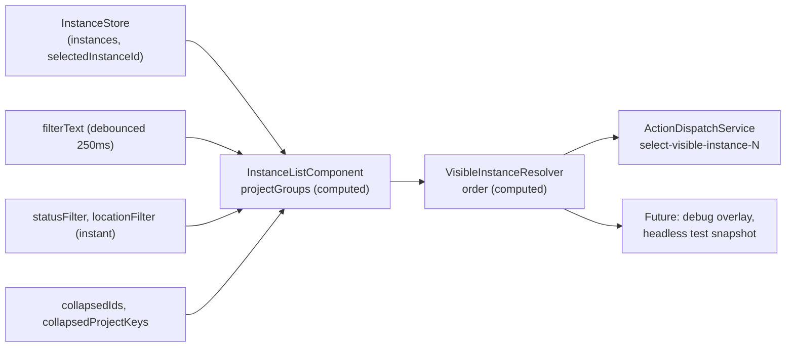
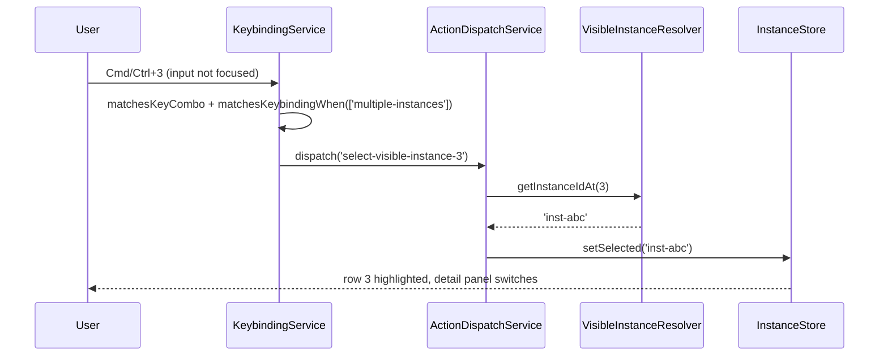
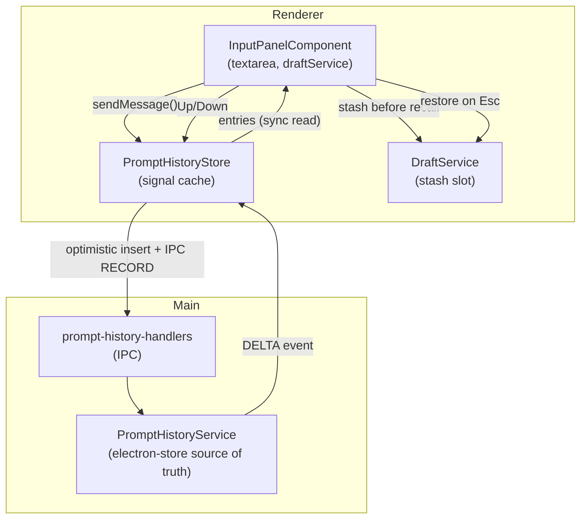
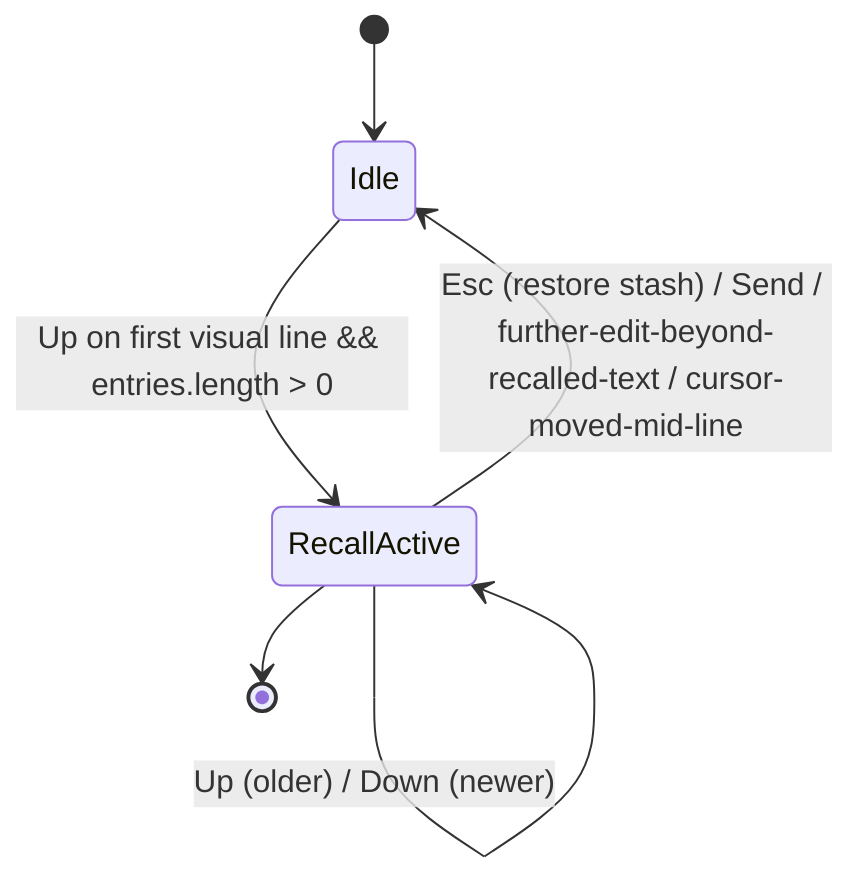
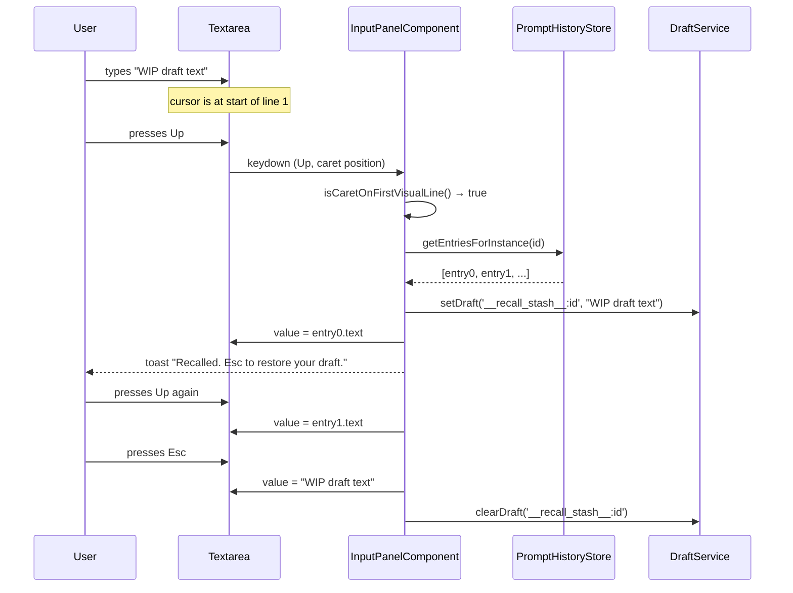
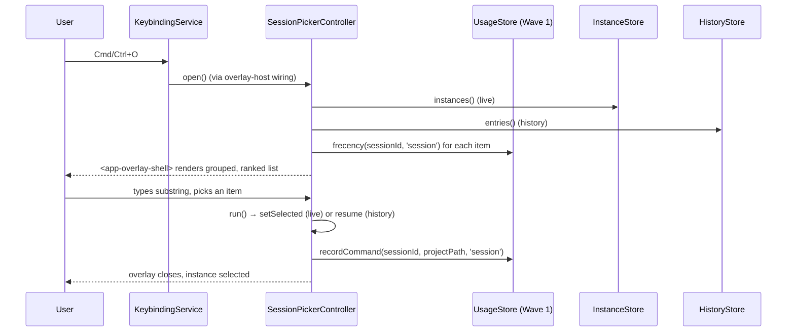

# Wave 2: Navigation, Pickers, & Prompt Recall — Design

**Date:** 2026-04-28
**Status:** Proposed
**Parent design:** [`docs/superpowers/specs/2026-04-28-cross-repo-usability-upgrades-design.md`](./2026-04-28-cross-repo-usability-upgrades-design.md) (Track A — Navigation, Pickers, And Prompt Recall continuation)
**Parent plan:** [`docs/superpowers/plans/2026-04-28-cross-repo-usability-upgrades-plan.md`](../plans/2026-04-28-cross-repo-usability-upgrades-plan.md) (Wave 2)
**Wave 1 design (depended on):** [`docs/superpowers/specs/2026-04-28-wave1-command-registry-and-overlay-design.md`](./2026-04-28-wave1-command-registry-and-overlay-design.md)
**Wave 1 plan:** [`docs/superpowers/plans/2026-04-28-wave1-command-registry-and-overlay-plan.md`](../plans/2026-04-28-wave1-command-registry-and-overlay-plan.md)
**Implementation plan (to follow):** `docs/superpowers/plans/2026-04-28-wave2-navigation-pickers-prompt-recall-plan.md`

## Doc taxonomy in this repo

This spec is one of several artifacts in a multi-wave program. To prevent confusion and doc sprawl:

| Artifact | Folder | Filename pattern | Purpose |
|---|---|---|---|
| **Design / spec** | `docs/superpowers/specs/` | `YYYY-MM-DD-<topic>-design.md` | What we're building, why, how it fits, types & contracts |
| **Plan** | `docs/superpowers/plans/` | `YYYY-MM-DD-<topic>.md` (or `…-plan.md`) | Wave/task breakdown, files to read, exit criteria |
| **Master / roadmap plan** | `docs/superpowers/plans/` | `YYYY-MM-DD-<name>-master-plan.md` | Multi-feature umbrella spanning many specs/plans |
| **Completed**  | either folder | `…_completed.md` suffix | Archived after the work shipped |

This document is a **per-wave child design** of the parent program design. The relationship is:

```
parent design (cross-repo-usability-upgrades-design.md)
  ├── Track A → wave 1 spec (command registry + overlay)         [shipped foundation]
  ├── Track A → this wave 2 spec (CHILD: nav, pickers, recall)
  ├── Track B → wave 3 spec (TBD)
  ├── Track C → wave 5 spec (TBD)
  └── Track D → waves 4 & 6 specs (TBD)

parent plan (cross-repo-usability-upgrades-plan.md)
  └── Wave 2 task list  ←── implemented by this child spec
```

Wave 2 **consumes** Wave 1 contracts (`OverlayShellComponent`, `OverlayController<T>`, `UsageTracker`/`UsageStore`, `CommandApplicability`). It does not modify them; it only adds new controllers and services that plug into them.

---

## Goal

Give operators fast, low-error navigation between live instances and recovery of recent prompts, plus add the next round of pickers (session, model/agent) on top of the Wave 1 overlay shell. Wave 2 ships:

1. `select-visible-instance-1..9` keybinding actions wired to `Cmd/Ctrl+1..9`, dispatched outside input contexts, gated so plain `1`-`9` typing in the composer is never stolen.
2. `VisibleInstanceResolver` renderer service that observes the project rail's filter / status / location / collapse state and exposes the **flat ordered array of currently rendered live instance IDs**, suitable for numeric-hotkey lookup.
3. Per-instance + per-project **prompt history** with a hybrid main/renderer storage model that mirrors Wave 1's `UsageTracker`/`UsageStore` (main is source of truth in `electron-store`; renderer caches and writes through). Capped at 100 entries per instance, configurable, pruned on app start.
4. Cursor-aware **Up / Down arrow recall** in the input panel (only when cursor is on the first / last visual line of the textarea), with **stash-and-restore** of the unsent draft so recall never clobbers in-progress text. `Ctrl+R` adds an optional reverse-search modal via the overlay shell.
5. **`SessionPickerController`** built on Wave 1's `OverlayShellComponent`. Frecency ranking pulls from Wave 1's `UsageStore` with `category: 'session'`.
6. **`ModelPickerController`** (and agent picker, scoped to the same controller) built on the overlay shell. Lists every model the active provider declares, plus shows incompatible / unavailable entries grayed-out via `CommandApplicability.disabledReason`.
7. Debounced project-rail filter text (250 ms) so large rails stop re-walking trees on every keystroke. Status / location filters remain instant.
8. New `@contracts/schemas/prompt-history` subpath with the four-place alias sync (`tsconfig.json`, `tsconfig.electron.json`, `src/main/register-aliases.ts`, `vitest.config.ts`) per the project's packaging gotcha.

## Decisions locked from brainstorming

| # | Decision | Rationale |
|---|---|---|
| 1 | **"Visible" = currently rendered after filter + grouping + collapse state.** Collapsed children don't count. The resolver returns a flat ordered array of instance IDs in render order. | Matches user expectation: the number on screen maps to the slot under it. Hidden / collapsed entries cannot be selected by hotkey because the user can't see them. |
| 2 | Prompt history persistence = **electron-store via main process** (mirrors Wave 1's `UsageTracker` hybrid). Per-instance lists, capped at **100 prompts each (configurable)**. Pruned on app start. | Single durable store survives app restart and instance respawn; renderer cache keeps recall sync. Cap prevents unbounded growth on long-lived instances. |
| 3 | Session picker frecency = **Wave 1 `UsageStore` with `category: 'session'`**. Reuse the same hybrid frecency formula; add `'session'` as a top-level category in the existing schema (no schemaVersion bump — extension is forward-compatible). | Avoids two parallel ranking paths. Wave 3's resume picker will reuse the same store with `category: 'resume'`. |
| 4 | **Model/agent picker** lists all entries from the active provider's compatible list and shows incompatible/unavailable as grayed-out via `applicability.disabledReason`. | Discoverability beats hiding. Mirrors Wave 1's disabled-command visual contract; one consistent UX across pickers. |
| 5 | Recall key binding = **`Up` / `Down` arrows in the textarea when cursor is on the first / last visual line**, plus **`Ctrl+R`** for reverse-search via overlay shell mode `prompt-history-search`. The `Ctrl+R` mode is **optional, gated**: ship if scope allows; defer to a follow-up otherwise. | The vast majority of users want Up/Down recall like a shell; Ctrl+R is the power-user escape hatch. Splitting the must-have from the nice-to-have lets us land Up/Down first. |
| 6 | **Draft preservation:** when recall replaces the textarea, the unsent draft is **stashed** to a dedicated `__recall_stash__` slot in `DraftService` first; a toast notifies the user. Stash is restored if the user presses Esc/cancels recall **before** sending or further editing. Once they edit beyond the recalled value or send, the stash is cleared. | Clobbering the user's in-progress text is the worst-case failure for this feature. Stash-and-restore makes recall safe. |
| 7 | Filter debounce = **250 ms on filter text only**. Status / location filters remain instant (small enums; don't trigger expensive tree walks). | Aligns with `DraftService.TEXT_DEBOUNCE_MS`; conservative enough to feel responsive, slow enough to avoid recomputing `projectGroups` per keystroke. |
| 8 | Numeric hotkeys are **active only outside input fields by default**. When the input has focus, plain `1`-`9` types numbers; only `Cmd/Ctrl+1..9` invokes the action. No conflicts with composer typing. | The keybinding service already skips modifier-less single-letter keys when an input is focused (lines 130–135 of `keybinding.service.ts`). The new actions ride that gate by design — `Cmd/Ctrl+digit` carries a modifier, so it works in both contexts. |
| 9 | New **`@contracts/schemas/prompt-history`** subpath; must update **4 alias-sync points** (`tsconfig.json`, `tsconfig.electron.json`, `src/main/register-aliases.ts`, `vitest.config.ts`) per AGENTS.md packaging gotcha #1. | Prompt history payload is large enough (records, batches) to warrant its own schema file. Same gotcha that bit Wave 1's `@contracts/schemas/command`; explicit checklist in the plan prevents the packaged-DMG-crash class of bug. |
| 10 | **Model picker scope:** Mandatory Wave 2 deliverable, sequenced after Session picker. Not gated like the optional Ctrl+R modal (Phase 12). | The parent plan's "only after overlay shell ranking is proven by command/session pickers" qualifier is a temporal sequencing note, not a scope-cut gate. Phase 10 (session picker) demonstrates the shell first; Phase 11 (model picker) follows. Both ship in Wave 2. |

## Validation method

The decisions and types in this spec were grounded by reading these files in full prior to drafting:

- Parent docs: `docs/superpowers/specs/2026-04-28-cross-repo-usability-upgrades-design.md`, `docs/superpowers/plans/2026-04-28-cross-repo-usability-upgrades-plan.md`
- Wave 1 contracts (depended on): `docs/superpowers/specs/2026-04-28-wave1-command-registry-and-overlay-design.md`, `docs/superpowers/plans/2026-04-28-wave1-command-registry-and-overlay-plan.md`
- Keybinding system: `src/shared/types/keybinding.types.ts`, `src/renderer/app/core/services/keybinding.service.ts`, `src/renderer/app/core/services/action-dispatch.service.ts`
- Project rail / visible order: `src/renderer/app/features/instance-list/instance-list.component.ts`, `src/renderer/app/features/instance-list/project-group-computation.service.ts`, `src/renderer/app/features/instance-list/instance-list.component.html`
- Drafts and composer: `src/renderer/app/core/services/draft.service.ts`, `src/renderer/app/core/services/new-session-draft.service.ts`, `src/renderer/app/features/instance-detail/input-panel.component.ts`, `src/renderer/app/features/instance-detail/input-panel.component.html`
- IPC and aliases: `src/main/register-aliases.ts`, `src/main/index.ts`, `src/preload/preload.ts`, `src/main/ipc/handlers/` (existing handler patterns)
- Schemas: `packages/contracts/src/schemas/instance.schemas.ts`, the new `command.schemas.ts` introduced by Wave 1 (template for our prompt-history schema)
- Stores: `src/renderer/app/core/state/instance.store.ts`, `src/renderer/app/core/state/instance/`, `src/renderer/app/core/state/command.store.ts`
- Tests as patterns: `src/renderer/app/core/state/instance/instance-list.store.spec.ts` (closest existing pattern for new specs)

---

## 1. Type model

All Wave 2 types live in `src/shared/types/prompt-history.types.ts` (new file) and `src/shared/types/keybinding.types.ts` (extended). All new fields and types are additive — no breaking changes to existing exports.

### 1.1 `PromptHistoryEntry`

```ts
/**
 * One captured prompt that the user successfully sent. Stored per instance,
 * with the instance's project path mirrored so per-project recall can fall
 * back when no per-instance match exists.
 */
export interface PromptHistoryEntry {
  /** Stable ID. Used for de-dup and as React/Angular trackBy. */
  id: string;
  /** The full prompt text the user sent (post-template expansion is *not* stored). */
  text: string;
  /** ms epoch when the prompt was sent. */
  createdAt: number;
  /** Working directory at send time, if known. Used for per-project recall. */
  projectPath?: string;
  /** Provider at send time (claude / gemini / codex / copilot / cursor). */
  provider?: string;
  /** Model at send time (e.g. 'claude-3-5-sonnet'). */
  model?: string;
  /** Whether this entry was sent as a slash command (so recall can re-show it as `/foo`). */
  wasSlashCommand?: boolean;
}
```

### 1.2 `PromptHistoryRecord` (per-instance list + per-project alias)

```ts
/**
 * Per-instance prompt list. Most-recent entry is at index 0 (LIFO).
 * Capped at PROMPT_HISTORY_MAX (default 100) entries per instance.
 */
export interface PromptHistoryRecord {
  instanceId: string;
  entries: PromptHistoryEntry[];
  /** Updated whenever entries changes; used for delta event filtering. */
  updatedAt: number;
}

/**
 * Persisted shape, schemaVersioned. Holds per-instance lists keyed by
 * instanceId and a separate per-project index for cross-instance recall.
 */
export interface PromptHistoryStoreV1 {
  schemaVersion: 1;
  /** Keyed by instanceId. */
  byInstance: Record<string, PromptHistoryRecord>;
  /**
   * Per-project alias index. Points at the most recent N entries for that
   * project, deduped, regardless of instance. Recomputed on each record() call
   * (cheap — 100 × ~10 instances per project = O(1k)).
   */
  byProject: Record<string, PromptHistoryProjectAlias>;
  /** ms epoch of the last successful prune (informational; reset on schema bump). */
  lastPrunedAt?: number;
}

export interface PromptHistoryProjectAlias {
  projectPath: string;
  /** Most-recent first; deduped on text. */
  entries: PromptHistoryEntry[];
  updatedAt: number;
}
```

### 1.3 `VisibleInstanceOrder` (return type of resolver)

```ts
/**
 * Flat ordered list of instance IDs currently rendered in the project rail
 * after filter + grouping + collapse state are applied. Index 0 is the topmost
 * visible row.
 *
 * `select-visible-instance-N` selects `instanceIds[N-1]` (1-indexed in the
 * keybinding name; 0-indexed in the array).
 */
export interface VisibleInstanceOrder {
  /** ms epoch when this snapshot was computed. Used for staleness asserts in tests. */
  computedAt: number;
  /** Length capped to whatever the rail produces; not pre-truncated to 9. */
  instanceIds: string[];
  /**
   * Optional — for diagnostics: project keys, in the same order as
   * instanceIds, so a debug overlay can show "1 → projectA / Session foo".
   */
  projectKeys?: string[];
}
```

### 1.4 `SessionPickerItem`

```ts
/**
 * Item shape consumed by SessionPickerController. The picker renders these as
 * OverlayItem<SessionPickerItem>.
 */
export interface SessionPickerItem {
  /** Stable id; matches the selectable instance/session id. */
  id: string;
  /** Primary label — instance display name or transcript title. */
  title: string;
  /** Subtitle — e.g. "claude / sonnet — 12 minutes ago". */
  subtitle?: string;
  /** Project path for grouping in the picker. */
  projectPath?: string;
  /** Provider; used for the right-hint badge. */
  provider?: string;
  /** Status: 'live' | 'history' | 'archived'. Live wins ranking ties. */
  kind: 'live' | 'history' | 'archived';
  /** Last-activity timestamp (ms epoch). */
  lastActivity?: number;
  /**
   * Pre-computed frecency score from UsageStore for this session id under
   * category 'session'. Used for sort order; the picker does not call back
   * into UsageStore on every keystroke.
   */
  frecencyScore: number;
}
```

### 1.5 `ModelPickerItem`

```ts
/**
 * Item shape consumed by ModelPickerController. Both model and agent pickers
 * use the same controller; `kind` distinguishes them at render time.
 */
export interface ModelPickerItem {
  id: string;
  /** Display name, e.g. 'Claude 3.5 Sonnet' or 'Build agent'. */
  label: string;
  /** Provider/agent group for grouping in the picker. */
  group: string;
  /** 'model' | 'agent'. */
  kind: 'model' | 'agent';
  /** Whether the active context can use this entry. Drives the disabled overlay. */
  available: boolean;
  /**
   * If !available, why? Mirrors Wave 1 CommandApplicability.disabledReason
   * shape. Examples: "Requires claude provider" / "Not in the active provider's
   * compatible list" / "Agent disabled in settings".
   */
  disabledReason?: string;
  /** Optional context tags (e.g. "fast", "long-context") rendered as small chips. */
  tags?: string[];
}
```

### 1.6 Keybinding action additions

`src/shared/types/keybinding.types.ts` extends `KeybindingAction` with:

```ts
export type KeybindingAction =
  // ── existing actions unchanged ──
  | 'focus-input' | 'focus-output' | 'focus-instance-list'
  | 'new-instance' | 'close-instance' | 'next-instance' | 'prev-instance' | 'restart-instance'
  | 'toggle-command-palette' | 'toggle-sidebar' | 'toggle-history' | 'toggle-settings'
  | 'zoom-in' | 'zoom-out' | 'zoom-reset'
  | 'send-message' | 'cancel-operation' | 'clear-input' | 'copy-last-response'
  | 'toggle-agent' | 'select-agent-build' | 'select-agent-plan'
  | `command:${string}`
  // ── new (Wave 2) ──
  | 'select-visible-instance-1'
  | 'select-visible-instance-2'
  | 'select-visible-instance-3'
  | 'select-visible-instance-4'
  | 'select-visible-instance-5'
  | 'select-visible-instance-6'
  | 'select-visible-instance-7'
  | 'select-visible-instance-8'
  | 'select-visible-instance-9'
  | 'open-session-picker'
  | 'open-model-picker'
  | 'open-prompt-history-search'   // optional, gated; landed only if Phase 12 ships
  | 'recall-prompt-prev'           // dispatched from input-panel keydown
  | 'recall-prompt-next';
```

`DEFAULT_KEYBINDINGS` gains nine entries for `select-visible-instance-1..9`, each:

```ts
{
  id: 'select-visible-instance-N',
  name: `Select Visible Instance ${N}`,
  description: `Switch focus to the Nth visible instance in the project rail`,
  keys: { key: String(N), modifiers: ['meta'] }, // Cmd/Ctrl+N — meta normalises to Cmd on macOS, Ctrl elsewhere
  action: `select-visible-instance-${N}`,
  context: 'global',
  when: ['multiple-instances'],
  category: 'Navigation',
  customizable: true,
}
```

Plus:

```ts
{
  id: 'open-session-picker',
  keys: { key: 'o', modifiers: ['meta'] },              // Cmd/Ctrl+O — "Open Session"
  action: 'open-session-picker',
  context: 'global',
  category: 'Navigation',
  customizable: true,
},
{
  id: 'open-model-picker',
  keys: { key: 'm', modifiers: ['meta', 'shift'] },     // Cmd/Ctrl+Shift+M — avoids conflict with Mute / minimize
  action: 'open-model-picker',
  context: 'global',
  category: 'Session',
  customizable: true,
},
{
  id: 'open-prompt-history-search',
  keys: { key: 'r', modifiers: ['ctrl'] },              // Ctrl+R: reverse-search idiom (active when input focused)
  action: 'open-prompt-history-search',
  context: 'input',
  category: 'Session',
  customizable: true,
}
```

> Note: `Cmd/Ctrl+O` is currently unbound in the project. If a future feature claims it, the binding remains `customizable: true` so the user can rebind in settings.

### 1.7 Public service signatures

#### `VisibleInstanceResolver` (renderer)

```ts
// src/renderer/app/core/services/visible-instance-resolver.service.ts

@Injectable({ providedIn: 'root' })
export class VisibleInstanceResolver {
  /** Reactive signal: re-emits whenever the rail's visible order changes. */
  readonly order: Signal<VisibleInstanceOrder>;

  /** Sync getter for one-shot reads (e.g. inside an action handler). */
  getOrder(): VisibleInstanceOrder;

  /** Convenience: 1-indexed lookup matching the keybinding name. */
  getInstanceIdAt(slot1Indexed: number): string | null;

  /**
   * Wired by InstanceListComponent: feed the resolver the latest projectGroups
   * computed signal so the resolver is the single source of truth for visible
   * order. The component does not own visibility — the resolver does.
   */
  setProjectGroupsSource(source: Signal<ProjectGroup[]>): void;
}
```

The resolver's internal `order` signal is `computed()` from the project groups source: it walks each group's `liveItems` (skipping collapsed children — `instance-list.component.ts` already does this in `projectGroups`), concatenates in render order, and emits.

### 1.7.1 Initialization & lifecycle contract

`VisibleInstanceResolver` is a root-singleton service (`@Injectable({ providedIn: 'root' })`).

**Default state (before any source is set):**
```ts
{ computedAt: 0, instanceIds: [], projectKeys: [] }
```

**Source registration:**
`InstanceListComponent` calls `setProjectGroupsSource(this.projectGroups)` in its constructor.

**Lifecycle on remount:**
- If `InstanceListComponent` is destroyed (e.g., route change) and recreated, the new instance's constructor re-registers its `projectGroups` signal. The resolver swaps to the new source on the next read.
- The resolver does NOT memoize across the swap; the next `order()` read recomputes from the new source.

**Multi-instance components:**
The codebase mounts `InstanceListComponent` once at the app shell level. If a future change introduces multiple instances, the resolver's `setProjectGroupsSource` should throw (or log + retain the most recent source). Add a guard with a clear error message: `"VisibleInstanceResolver: source already set; only one InstanceListComponent is supported"`.

#### `PromptHistoryService` (main)

```ts
// src/main/prompt-history/prompt-history-service.ts

export class PromptHistoryService {
  /** Lazy singleton. */
  static getInstance(): PromptHistoryService;
  static _resetForTesting(): void;

  /** Snapshot for a single instance, most-recent first. */
  getForInstance(instanceId: string): PromptHistoryRecord;

  /** Snapshot for a project (deduped on text across all instances under that project). */
  getForProject(projectPath: string): PromptHistoryProjectAlias;

  /**
   * Append an entry to the instance's list. Prunes to PROMPT_HISTORY_MAX (default 100,
   * configurable via SettingsStore). De-dupes consecutive duplicates (if the new entry's
   * text === the head of the list, refresh the head's createdAt instead of pushing).
   * Emits a 'change' event with the changed instanceId.
   */
  record(entry: PromptHistoryEntry & { instanceId: string }): void;

  /** Remove all entries for an instance (called on instance close). */
  clearForInstance(instanceId: string): void;

  /** Subscribe to change events; returns unsubscribe. */
  onChange(listener: (delta: { instanceId: string; record: PromptHistoryRecord }) => void): () => void;

  /** App-start prune: drops entries beyond max-per-instance and removes empty records. */
  pruneOnStart(): void;
}

export function getPromptHistoryService(): PromptHistoryService;
```

#### `PromptHistoryStore` (renderer cache)

```ts
// src/renderer/app/core/state/prompt-history.store.ts

@Injectable({ providedIn: 'root' })
export class PromptHistoryStore {
  /** Signal — reactive snapshot keyed by instanceId. */
  readonly records: Signal<Record<string, PromptHistoryRecord>>;
  readonly projectAliases: Signal<Record<string, PromptHistoryProjectAlias>>;

  /** Initial seed from main; subscribes to the delta channel. */
  init(): Promise<void>;

  /**
   * Optimistic local append + fire-and-forget IPC. Used by InputPanelComponent
   * after a successful sendMessage. Main is the source of truth and re-emits
   * the canonical record back as a delta — the local optimistic insert is
   * keyed by entry.id so the delta replaces it without flicker.
   */
  record(entry: PromptHistoryEntry & { instanceId: string }): void;

  /** Sync read for the recall navigator. Most-recent first. */
  getEntriesForInstance(instanceId: string): readonly PromptHistoryEntry[];
  getEntriesForProject(projectPath: string): readonly PromptHistoryEntry[];

  /** Cleared if the instance is closed. */
  clearForInstance(instanceId: string): void;
}
```

#### IPC channels

| Channel | Direction | Payload schema | Response |
|---|---|---|---|
| `PROMPT_HISTORY_GET_SNAPSHOT` | renderer → main | `{}` | `{ byInstance: Record<string, PromptHistoryRecord>; byProject: Record<string, PromptHistoryProjectAlias> }` |
| `PROMPT_HISTORY_RECORD` | renderer → main | `{ instanceId: string; entry: PromptHistoryEntry }` | `{ ok: true }` |
| `PROMPT_HISTORY_CLEAR_INSTANCE` | renderer → main | `{ instanceId: string }` | `{ ok: true }` |
| `PROMPT_HISTORY_DELTA` | main → renderer (event) | `{ instanceId: string; record: PromptHistoryRecord }` | — |

All payloads are validated by Zod schemas in `packages/contracts/src/schemas/prompt-history.schemas.ts` (new file — see § 5).

---

## 2. Visible-instance order

`InstanceListComponent.projectGroups` (lines 133–328 of `instance-list.component.ts`) is the canonical computed signal that drives display order. It's already filter+grouping+collapse aware via `ProjectGroupComputationService.buildVisibleItems()`. Wave 2 does **not** rewrite this — it consumes it.

### 2.1 Resolver wiring



### 2.2 Why a separate resolver?

- The `select-visible-instance-N` action runs from `ActionDispatchService`, which sits below the components in the DI graph. It cannot reach into `InstanceListComponent`.
- The resolver lives at the same DI level as `InstanceStore`, so the dispatcher can ask it directly: `resolver.getInstanceIdAt(N)`.
- Wave 2's tests want a single seam to assert against. The resolver is that seam — `instance-list.component.ts` becomes "render this signal" and the resolver's spec covers ordering correctness.

### 2.3 What "visible" includes / excludes

| Item | In `order`? | Why |
|---|---|---|
| Live instance row | yes | Selectable via numeric hotkey |
| Collapsed parent (still rendered) | yes | The row itself is visible |
| Collapsed parent's children | **no** | Children are not rendered when parent is collapsed |
| History-only entry (no live instance) | **no** | `select-visible-instance-N` selects live instances; history rows have a different action ("resume") |
| Filtered-out by text/status/location | **no** | Not on screen |
| Recent-directory placeholder (no instance) | **no** | No id to select |

### 2.4 Source signal contract

`InstanceListComponent` calls `resolver.setProjectGroupsSource(this.projectGroups)` once in its constructor. After that, the resolver is the authoritative API for visible order. The component does not export the order itself.

---

## 3. Numeric hotkeys

### 3.1 Action wiring



### 3.2 Input-context safety

The keybinding service already has the relevant safeguard (lines 130–135 of `keybinding.service.ts`):

```ts
// If we're in an input and the binding is global without requiring modifiers,
// skip to avoid interfering with typing
if (isInputElement && binding.context === 'global') {
  const keys = Array.isArray(binding.keys) ? binding.keys[0] : binding.keys;
  if (keys.modifiers.length === 0 && keys.key.length === 1) {
    continue;
  }
}
```

Numeric hotkeys carry `modifiers: ['meta']` so they are **not** skipped in input contexts — pressing `Cmd/Ctrl+3` while typing in the composer still switches instances. Pressing plain `3` in the composer types `3` because the binding has a modifier. This is decision #8 above.

### 3.3 Out-of-range / no-op handling

- If `slot > order.instanceIds.length`, `ActionDispatchService.dispatch` resolves the action's `run` to `null` and does nothing (silent no-op — no error toast). This matches existing behavior for `next-instance` when only one instance is open.
- If the resolver is unwired (e.g. `InstanceListComponent` not yet mounted), `getOrder()` returns `{ computedAt, instanceIds: [], projectKeys: [] }` and the action no-ops.

### 3.4 Action registration shape

```ts
// In some bootstrap location (e.g. app.component.ts ngOnInit, or a
// dedicated NavigationActionsService that runs at root), register one
// UiActionRegistration per slot:

const actionDispatch = inject(ActionDispatchService);
const resolver = inject(VisibleInstanceResolver);
const instanceStore = inject(InstanceStore);

for (let n = 1; n <= 9; n++) {
  actionDispatch.register({
    id: `select-visible-instance-${n}`,
    when: ['multiple-instances'],
    run: () => {
      const id = resolver.getInstanceIdAt(n);
      if (id) instanceStore.setSelected(id);
    },
  });
}
```

The `when: ['multiple-instances']` gate matches the existing `next-instance`/`prev-instance` defaults; with one instance, the hotkey is inert (no flicker).

---

## 4. Prompt history

> **Storage namespace:** `new Store({ name: 'prompt-history' })`. This is intentionally distinct from Wave 1's `'usage-tracker'` store. Both stores coexist; neither writes to the other's namespace.

### 4.1 Data flow



### 4.2 Recall: cursor-aware Up/Down

The textarea recall trigger uses **caret position vs. visual line** semantics:

- `Up` recalls **only when the caret is on the first visual line** (i.e. there is no `\n` in the text *before* the caret AND the caret is in the topmost wrapped row of the first logical line).
- `Down` advances forward through the recall stack **only when the caret is on the last visual line**, similar logic.
- Otherwise the arrow keys work normally as text navigation.

### 4.2.1 Detecting "first/last visual line"

There is no DOM API that returns "is the caret on the first visual line of a wrapped textarea." The implementation uses a small utility:

```ts
/**
 * Returns true when the textarea's caret is on the first visual line.
 * Strategy: clone the textarea's font/size/width, render the substring up to
 * the caret in a hidden mirror div with the same wrapping, measure its
 * client height. If height ≤ one-line-height (computed from the textarea's
 * line-height), the caret is on the first visual line.
 */
export function isCaretOnFirstVisualLine(el: HTMLTextAreaElement): boolean;
export function isCaretOnLastVisualLine(el: HTMLTextAreaElement): boolean;
```

A single hidden mirror div (lazy-created on first call, attached to `document.body`, kept off-screen via `position: absolute; visibility: hidden; top: -9999px`) is reused for measurement. The mirror div's `font`, `padding`, `width`, and `box-sizing` are copied from the live textarea on each call (cheap; called only on Up/Down).

### 4.2.2 Logical line vs. visual line

If the textarea contains `\n` characters, "first visual line" still means *visual*: pressing Up on the second wrapped row of a multi-line draft moves the caret up one row inside the textarea. Only when the caret is on the topmost row (no chars before it that wrap to a row above) does Up trigger recall. This matches shell/Bash behavior and is what users expect.

### 4.3 Recall navigator state



State held inside `InputPanelComponent`:

```ts
private recallState = signal<{
  active: boolean;
  index: number;          // 0 = newest entry; -1 = back at stash
  stashedDraft: string;   // the user's text at the moment recall began
  stashedSlotKey: string; // DraftService key for the stash; cleared on commit
} | null>(null);
```

### 4.4 Stash-and-restore lifecycle

1. **First Up** (recall begins):
   - Capture current textarea value as `stashedDraft`.
   - Write `stashedDraft` to `DraftService.setDraft('__recall_stash__:<instanceId>', stashedDraft)`.
   - Replace textarea with `entries[0].text`. Index = 0.
   - Show toast: "Recalled from history. Esc to restore your draft."

2. **Subsequent Up**: Index = min(index + 1, entries.length - 1). Replace textarea with `entries[index].text`.

3. **Down**: Index = max(index - 1, -1).
   - If index becomes -1, restore textarea to `stashedDraft` (from the in-memory `recallState.stashedDraft`, not from `DraftService` — keeps it sync) and exit recall (set `recallState` to null).
   - Otherwise replace textarea with `entries[index].text`.

4. **Esc**: Same as "Down to -1". Restore `stashedDraft` and exit recall.

5. **Send / editing beyond the recalled value**:
   - `recallState` set to null.
   - `DraftService.clearDraft('__recall_stash__:<instanceId>')`.
   - The recalled text now becomes the active draft; if not sent, it persists in the regular `DraftService` slot for that instance.

6. **Instance switch / unmount**:
   - `recallState` is reset to null on instance change. The stash is restored to the textarea once (so the user doesn't lose their text when switching back).
   - The stash slot in `DraftService` is keyed by instance id, so it survives instance switching but is cleared when the instance is closed.

### 4.5 Recording on send

`InputPanelComponent`'s existing `sendMessage` flow is the only entry point that produces history. After the existing `sendMessage.emit(text)` succeeds (the parent component returns success):

```ts
this.promptHistoryStore.record({
  id: createPromptHistoryEntryId(),
  instanceId: this.instanceId(),
  text,
  createdAt: Date.now(),
  projectPath: this.workingDirectory(),
  provider: this.provider(),
  model: this.currentModel(),
  wasSlashCommand: text.trim().startsWith('/'),
});
```

The store appends optimistically and fires the IPC; main de-dupes against the head, prunes to 100, and emits the canonical `DELTA`. The renderer's optimistic entry is replaced by `id`.

### 4.6 Slash commands

When `wasSlashCommand` is true, recall replays the *original* prompt text (including the leading `/`). The composer's slash dropdown re-engages naturally because `onInput` fires from the recall replacement (we set the textarea `value` and dispatch a synthetic `input` event so the dropdown updates).

### 4.7 Capacity & pruning

| Constant | Default | Source of truth |
|---|---|---|
| `PROMPT_HISTORY_MAX` | 100 | `src/shared/types/prompt-history.types.ts` |
| `PROMPT_HISTORY_PRUNE_ON_START` | true | hardcoded — pruning is cheap |
| `PROMPT_HISTORY_DEDUPE_HEAD` | true | de-dup consecutive duplicates by refreshing `createdAt` |

> **Decision lock:** `PROMPT_HISTORY_DEDUPE_HEAD` is a **global constant**, not a per-store or per-instance setting. The behavior is fixed across all instances and projects. If the program later needs per-store override, the change requires (a) extending `PromptHistoryStoreV1` with a `config?: { dedupeHead?: boolean }` field, (b) bumping the schema to v2, and (c) writing a v1→v2 migration. Wave 2 explicitly does NOT take this on.

`PromptHistoryService.pruneOnStart` runs once during `src/main/index.ts` initialization (after `electron-store` is up but before any IPC handlers register). It walks `byInstance`, truncates each `entries` array to `PROMPT_HISTORY_MAX`, drops empty records, and rebuilds `byProject` from the remaining entries.

A future setting `promptHistoryMaxEntries` (added to `SettingsStore` as a number, validated 10–500, default 100) can override the constant; Wave 2 hardcodes 100 and the spec leaves the setting as a follow-up.

### 4.8 `Ctrl+R` reverse-search modal (gated)

If scope allows, ship a `PromptHistorySearchController` that opens the Wave 1 `OverlayShellComponent` in mode `prompt-history-search`. It:

- Lists prompt entries from `PromptHistoryStore.getEntriesForProject(currentProject)` (falls back to instance-only if no project).
- Filters by substring match.
- On `Enter`, replaces the textarea with the selected entry and closes the overlay (using the same stash-and-restore mechanism as Up/Down).
- On `Esc`, closes without changing the textarea.

Because this is a Wave 1 controller pattern, the controller class is small (~150 LOC) and reuses everything. **It is gated**: if Phase 12 runs out of budget, the spec ships without it and the keybinding `open-prompt-history-search` simply has no registered action, which is a no-op. This is intentionally low-cost to defer.

---

## 5. Schema package extraction (`@contracts/schemas/prompt-history`)

Prompt-history schemas live in their own subpath because (a) the surface is large enough (record, entry, batch) that adding it to `instance.schemas.ts` would obscure both, and (b) Wave 3 (resume) and Wave 4 (clipboard) will extend this without us wanting to migrate again later.

### 5.1 New file

`packages/contracts/src/schemas/prompt-history.schemas.ts`

```ts
import { z } from 'zod';
import { InstanceIdSchema } from './instance.schemas';

export const PromptHistoryEntrySchema = z.object({
  id: z.string().min(1).max(100),
  text: z.string().max(100_000),
  createdAt: z.number().int().nonnegative(),
  projectPath: z.string().min(1).max(10_000).optional(),
  provider: z.string().max(50).optional(),
  model: z.string().max(100).optional(),
  wasSlashCommand: z.boolean().optional(),
});

export const PromptHistoryRecordSchema = z.object({
  instanceId: InstanceIdSchema,
  entries: z.array(PromptHistoryEntrySchema).max(500), // generous upper bound; runtime cap is 100
  updatedAt: z.number().int().nonnegative(),
});

export const PromptHistoryProjectAliasSchema = z.object({
  projectPath: z.string().min(1).max(10_000),
  entries: z.array(PromptHistoryEntrySchema).max(500),
  updatedAt: z.number().int().nonnegative(),
});

export const PromptHistoryGetSnapshotPayloadSchema = z.object({}).strict();

export const PromptHistoryRecordPayloadSchema = z.object({
  instanceId: InstanceIdSchema,
  entry: PromptHistoryEntrySchema,
});

export const PromptHistoryClearInstancePayloadSchema = z.object({
  instanceId: InstanceIdSchema,
});
```

### 5.2 Required alias-sync edits (4 places, per packaging gotcha #1)

1. **`tsconfig.json`** → add `"@contracts/schemas/prompt-history": ["./packages/contracts/src/schemas/prompt-history.schemas.ts"]` to `compilerOptions.paths`.
2. **`tsconfig.electron.json`** → identical addition.
3. **`src/main/register-aliases.ts`** → add `'@contracts/schemas/prompt-history': path.join(baseContracts, 'schemas', 'prompt-history.schemas')` to the `exactAliases` object (next to the existing `'@contracts/schemas/instance'` line).
4. **`vitest.config.ts`** → add the alias under `resolve.alias` if the test config doesn't compute aliases from `tsconfig`. Verify by reading the file before editing — the existing config may already share the tsconfig paths via `vite-tsconfig-paths`.

Verification: a sanity import inside `src/main/prompt-history/prompt-history-service.ts` (`import type { PromptHistoryEntrySchema as _Probe } from '@contracts/schemas/prompt-history';`) plus `npx tsc --noEmit` from the renderer perspective AND `npx tsc --noEmit -p tsconfig.electron.json` from the main perspective AND a packaged DMG smoke test (Phase 13) catch the gotcha class.

---

## 6. UI flows

### 6.1 Numeric hotkey (no input focus)

Already covered in § 3.1. One sentence summary: keybinding fires → action dispatch → resolver lookup → `instanceStore.setSelected`.

### 6.2 Numeric hotkey (input focused, with Cmd/Ctrl)

```mermaid
sequenceDiagram
  participant U as User
  participant T as Textarea (focused)
  participant K as KeybindingService
  participant A as ActionDispatchService

  U->>T: presses Cmd+5
  T->>K: keydown event (target=textarea)
  K->>K: isInputElement=true; binding has modifiers → not skipped
  K->>A: dispatch('select-visible-instance-5')
  Note over T: textarea content unchanged; '5' not inserted
  A-->>U: row 5 highlighted, detail panel switches
```

### 6.3 Numeric hotkey (input focused, without modifier)

```mermaid
sequenceDiagram
  participant U as User
  participant T as Textarea (focused)
  participant K as KeybindingService

  U->>T: presses '5' (no modifier)
  T->>K: keydown event (target=textarea)
  K->>K: isInputElement=true; binding has no modifiers and key length 1 → SKIP
  K-->>T: returns; textarea handles native input
  T-->>U: '5' typed into composer
```

### 6.4 Prompt history recall



### 6.5 Session picker



### 6.6 Model picker

```mermaid
sequenceDiagram
  participant U as User
  participant K as KeybindingService
  participant MC as ModelPickerController
  participant PR as ProviderStateService
  participant IS as InstanceStore

  U->>K: Cmd/Ctrl+Shift+M
  K->>MC: open()
  MC->>PR: compatibleModels(activeProvider)
  MC->>PR: allModels() (cross-provider, for grayed-out display)
  MC-->>U: overlay-shell with available models grouped by provider; incompatible grayed-out
  U->>MC: picks a model
  MC->>IS: setModel(activeInstanceId, modelId)
  MC-->>U: overlay closes
```

> Per parent plan's sequencing note, the model picker ships AFTER the session picker in this wave. The two pickers prove the controller pattern (different result kinds, different IPC sources) before Wave 5/6 add more controllers.

---

## 7. Renderer integration points

### 7.1 `InstanceListComponent` — minimal diff

- Inject `VisibleInstanceResolver`.
- In the constructor: `this.resolver.setProjectGroupsSource(this.projectGroups);`.
- Wrap `filterText` updates in a 250 ms debounce. The existing `filterText = signal<string>('')` becomes `_rawFilterText` and a debounced `filterText` is derived. Concrete pattern (matches `DraftService.TEXT_DEBOUNCE_MS`):

```ts
private _rawFilterText = signal<string>('');
private filterDebounceTimer: ReturnType<typeof setTimeout> | null = null;
filterText = signal<string>('');

setFilterText(value: string): void {
  this._rawFilterText.set(value);
  if (this.filterDebounceTimer !== null) clearTimeout(this.filterDebounceTimer);
  this.filterDebounceTimer = setTimeout(() => {
    this.filterText.set(this._rawFilterText());
    this.filterDebounceTimer = null;
  }, 250);
}
```

The template binds the input's `(input)` event to `setFilterText($event.target.value)` and the input's `[value]` to `_rawFilterText()` (so the input is responsive even though the computed downstream is debounced).

- Status / location filter unchanged — they already write to plain signals and stay instant.

### 7.2 `InputPanelComponent` — minimal diff

- Inject `PromptHistoryStore` and `DraftService` (already injected).
- Add the `recallState` signal and `isCaretOnFirstVisualLine` / `isCaretOnLastVisualLine` utility imports.
- In `onKeyDown`:
  - `Escape` while `recallState()?.active` → restore stash, set `recallState` to null, prevent default.
  - `ArrowUp` && `isCaretOnFirstVisualLine(textarea)` && entries available → enter recall, replace value, prevent default.
  - `ArrowDown` && `recallState()?.active` && `isCaretOnLastVisualLine(textarea)` → step forward in recall (or restore stash at index -1).
  - All other keys: proceed as today.
- After a successful send (in the existing `onSendMessage` or wherever the parent's `sendMessage.emit` is invoked successfully), call `promptHistoryStore.record(...)`.
- On `instanceId` change (effect): if recall was active, restore stash and exit recall; clear stash for the leaving instance.

### 7.3 `ActionDispatchService` — minimal diff

- Add registrations for `select-visible-instance-1..9` (loop, see § 3.4).
- Add registrations for `open-session-picker`, `open-model-picker`, `open-prompt-history-search` (each `run` mounts the host component via the existing dialog/overlay pattern used by the command palette).
- Add registrations for `recall-prompt-prev` / `recall-prompt-next` if we want them to be available outside the input context (current scope: only used internally by `InputPanelComponent`, so no global action needed; the keybinding entries are kept commented-out in the spec and not added in Wave 2).

### 7.4 Picker host components

Two new host components:

- `SessionPickerHostComponent` (`src/renderer/app/features/overlay-modes/session-picker.host.component.ts`) — analogous to Wave 1's `CommandPaletteHostComponent`. Renders `<app-overlay-shell>` bound to `SessionPickerController`.
- `ModelPickerHostComponent` (`src/renderer/app/features/overlay-modes/model-picker.host.component.ts`) — same shape, bound to `ModelPickerController`.
- (Gated) `PromptHistorySearchHostComponent` (`src/renderer/app/features/overlay-modes/prompt-history-search.host.component.ts`).

Mounting follows the existing palette mount pattern (the dispatcher's `app.open-command-help` action is the closest example — Wave 1 wires it).

---

## 8. Testing strategy

### 8.1 Unit specs (new)

- `src/shared/types/__tests__/prompt-history.types.spec.ts` — `PROMPT_HISTORY_MAX` constant present; ID generator unique.
- `src/main/prompt-history/__tests__/prompt-history-service.spec.ts` — record / get / clear / prune-on-start / dedupe-head / capacity cap / per-project alias rebuild.
- `src/main/ipc/handlers/__tests__/prompt-history-handlers.spec.ts` — Zod validation, success and error paths, delta broadcast.
- `src/renderer/app/core/state/__tests__/prompt-history.store.spec.ts` — init seeds from IPC, optimistic insert replaced by canonical delta, sync read returns latest.
- `src/renderer/app/core/services/__tests__/visible-instance-resolver.service.spec.ts` — order signal reflects mocked project-groups source, `getInstanceIdAt` 1-indexed, out-of-range returns null, collapsed parents excluded from order.
- `src/renderer/app/features/overlay-modes/__tests__/session-picker.controller.spec.ts` — filtering, frecency from mocked `UsageStore`, run() updates `InstanceStore` for live and calls resume for history.
- `src/renderer/app/features/overlay-modes/__tests__/model-picker.controller.spec.ts` — incompatible models grayed out, applicable models grouped by provider, run() sets model on active instance.
- (Gated) `src/renderer/app/features/overlay-modes/__tests__/prompt-history-search.controller.spec.ts`.
- `src/renderer/app/features/instance-detail/__tests__/input-panel-recall.spec.ts` — Up on first visual line triggers recall; subsequent Up steps; Esc restores stash; send clears stash; switching instances exits recall.
- `src/renderer/app/core/services/keybinding.service.spec.ts` (new — none currently exists per scout) — verify input-context modifier-on-letter-key gate; verify `select-visible-instance-N` is dispatched with input focus when modifier is present.
- `src/renderer/app/features/instance-list/__tests__/instance-list.debounce.spec.ts` — typing into the rail filter input debounces `filterText` updates by 250 ms; status/location updates are instant.

### 8.2 Specs to update

- `src/shared/types/__tests__/keybinding.types.spec.ts` (existing) — add cases for the new `KeybindingAction` literal members.

### 8.3 Integration / manual

- Open the rail with > 9 instances. Verify Cmd/Ctrl+1..9 selects rows 1–9, with 1 = topmost visible.
- Collapse a parent with children. Verify the children disappear from the numeric-hotkey targeting (the next visible row gets that slot).
- Filter the rail; verify the same.
- Send 5 prompts in a fresh instance. Press Up — the latest is restored. Press Up again — the previous appears. Esc — original draft returns.
- Type a partial draft, press Up, edit the recalled value heavily, press Down — should NOT re-stash (the recalled value is now the active draft).
- Restart the app. Open the same instance. Up should still pull the prior 5 prompts (persistence verified).
- Open the session picker. Pick a history item. Verify the session resumes and frecency increments.
- Open the model picker for a Claude instance. Verify Gemini models appear grayed out with "Requires gemini provider" tooltip.
- Type fast in the rail filter. Verify the rail doesn't recompute on every keystroke (open the dev tools profiler if needed).
- Build and launch the packaged DMG. Verify no `Cannot find module '@contracts/schemas/prompt-history'` error on startup.

---

## 9. Telemetry & logging

- `PromptHistoryService.record()` logs at `debug` only when text length > 10 KB (suspicious paste).
- `VisibleInstanceResolver` does not log; failures are silent no-ops.
- `SessionPickerController.run()` logs at `info` on session-resume initiation (matches Wave 1's command-execute logging).
- Pruning on start logs one summary line: `"Pruned prompt history: dropped X entries across Y instances"`.

---

## 10. IPC contract additions

| Channel | Direction | Payload schema | Response |
|---|---|---|---|
| `PROMPT_HISTORY_GET_SNAPSHOT` | renderer → main | `PromptHistoryGetSnapshotPayloadSchema` | `{ byInstance, byProject }` |
| `PROMPT_HISTORY_RECORD` | renderer → main | `PromptHistoryRecordPayloadSchema` | `{ ok: true }` |
| `PROMPT_HISTORY_CLEAR_INSTANCE` | renderer → main | `PromptHistoryClearInstancePayloadSchema` | `{ ok: true }` |
| `PROMPT_HISTORY_DELTA` | main → renderer (event) | `{ instanceId: string; record: PromptHistoryRecord }` | — |

Channel constants land in `src/shared/types/ipc.types.ts`:

```ts
PROMPT_HISTORY_GET_SNAPSHOT: 'promptHistory:getSnapshot',
PROMPT_HISTORY_RECORD:       'promptHistory:record',
PROMPT_HISTORY_CLEAR_INSTANCE: 'promptHistory:clearInstance',
PROMPT_HISTORY_DELTA:        'promptHistory:delta',
```

Preload exposes `electronAPI.promptHistory.{getSnapshot,record,clearInstance,onDelta}` mirroring Wave 1's `electronAPI.usage.*` shape.

---

## 11. File-by-file change inventory

### Created

| Path | Purpose |
|---|---|
| `src/shared/types/prompt-history.types.ts` | `PromptHistoryEntry`, `PromptHistoryRecord`, `PROMPT_HISTORY_MAX`, helpers |
| `packages/contracts/src/schemas/prompt-history.schemas.ts` | Zod schemas for IPC |
| `src/main/prompt-history/prompt-history-store.ts` | `electron-store` wrapper for `PromptHistoryStoreV1` |
| `src/main/prompt-history/prompt-history-service.ts` | `PromptHistoryService` singleton |
| `src/main/ipc/handlers/prompt-history-handlers.ts` | IPC handlers for new channels |
| `src/renderer/app/core/services/ipc/prompt-history-ipc.service.ts` | Renderer IPC client |
| `src/renderer/app/core/state/prompt-history.store.ts` | `PromptHistoryStore` write-through cache |
| `src/renderer/app/core/services/visible-instance-resolver.service.ts` | `VisibleInstanceResolver` |
| `src/renderer/app/core/services/textarea-caret-position.util.ts` | `isCaretOnFirstVisualLine` / `isCaretOnLastVisualLine` |
| `src/renderer/app/features/overlay-modes/session-picker.controller.ts` | Wave 1 controller for session picker |
| `src/renderer/app/features/overlay-modes/session-picker.host.component.ts` | Host component for session picker |
| `src/renderer/app/features/overlay-modes/model-picker.controller.ts` | Wave 1 controller for model picker |
| `src/renderer/app/features/overlay-modes/model-picker.host.component.ts` | Host component for model picker |
| `src/renderer/app/features/overlay-modes/prompt-history-search.controller.ts` *(gated)* | Optional: reverse-search controller |
| `src/renderer/app/features/overlay-modes/prompt-history-search.host.component.ts` *(gated)* | Optional: host |
| Spec files mirroring each above | See § 8.1 |

### Modified

| Path | Change |
|---|---|
| `src/shared/types/keybinding.types.ts` | Extend `KeybindingAction`; add 9 numeric + 3 picker entries to `DEFAULT_KEYBINDINGS` |
| `src/shared/types/ipc.types.ts` | Add new channel constants |
| `src/renderer/app/core/services/keybinding.service.ts` | No code change required (existing input-context gate already handles modifier-bearing numeric hotkeys); add unit spec |
| `src/renderer/app/core/services/action-dispatch.service.ts` | Register 9 numeric actions, 3 picker actions |
| `src/renderer/app/features/instance-list/instance-list.component.ts` | Inject resolver; debounce `filterText`; set resolver source |
| `src/renderer/app/features/instance-list/instance-list.component.html` | Bind `(input)` to `setFilterText`; bind `[value]` to `_rawFilterText()` |
| `src/renderer/app/features/instance-detail/input-panel.component.ts` | Recall logic: signal, key handlers, store wiring |
| `src/renderer/app/features/instance-detail/input-panel.component.html` | (Likely no change — keydown / keyup already bound) |
| `src/preload/preload.ts` | Expose new IPC |
| `src/main/index.ts` | `getPromptHistoryService()`, `pruneOnStart()`, register IPC handlers |
| `tsconfig.json` | Add `@contracts/schemas/prompt-history` alias |
| `tsconfig.electron.json` | Same |
| `src/main/register-aliases.ts` | Same |
| `vitest.config.ts` | Same (if not auto-derived) |
| `docs/superpowers/plans/2026-04-28-cross-repo-usability-upgrades-plan.md` | Mark Wave 2 tasks `[x]` after landing |

### Removed

None. Wave 2 is purely additive.

---

## 12. Acceptance criteria

The wave is shippable when **all** of the following hold:

1. `npx tsc --noEmit` passes.
2. `npx tsc --noEmit -p tsconfig.spec.json` passes.
3. `npm run lint` passes with no new warnings.
4. New unit specs (§ 8.1) pass; existing specs still pass.
5. Pressing `Cmd/Ctrl+N` (1–9) from anywhere selects the Nth visible instance. Plain `1`-`9` while the composer is focused types numerals into the composer.
6. Filtering, collapsing, and status changes update the Cmd/Ctrl+N targets within one frame after the 250 ms debounce settles.
7. `Up` with the cursor on the first visual line replaces the textarea with the most recent prompt and stashes the unsent draft. `Esc` restores the draft. Sending clears the stash.
8. Send a prompt, restart the app, return to the same instance. `Up` still recalls the prompt.
9. `Cmd/Ctrl+O` opens the session picker; selecting a live instance switches focus; selecting a history entry resumes it.
10. `Cmd/Ctrl+Shift+M` opens the model picker; incompatible models are grayed out with a tooltip reason.
11. Rail filter typing does not jank when there are > 100 instances (manual perf check via dev-tools profiler).
12. The packaged DMG starts (smoke run) — confirms the `@contracts/schemas/prompt-history` alias-sync edits are correct.

---

## 13. Non-goals

- No clipboard or notification primitive (Wave 4).
- No resume picker (Wave 3 — though `SessionPickerController.run` covers history resume of the currently rendered session set).
- No prompt-history search beyond the optional `Ctrl+R` modal (advanced history search is Wave 3 / Track B).
- No telemetry export of prompt history (privacy: Wave 6 will discuss whether to expose at all).
- No editing history entries — they're append-only and pruned by capacity.
- No multi-window history sync — both windows share the same `electron-store` so writes propagate via DELTA, but cross-window race conditions are not specifically tested.

---

## 14. Risks & mitigations

| Risk | Likelihood | Impact | Mitigation |
|---|---|---|---|
| Alias-sync edits forgotten → packaged app crashes on startup with `Cannot find module @contracts/schemas/prompt-history` | Med | High | Plan includes explicit DMG smoke-test step; spec § 5.2 lists all 4 sites. |
| Caret-position detection misfires on weird fonts / zoom → recall triggers on second visual line or ignores legitimate first-line presses | Med | Med | Use a single mirror div with copied font/padding/width; unit test the utility against 20 hand-picked text/caret pairs covering wrapped-line edges; manual zoom in/out check during smoke. |
| Numeric hotkey conflicts with composer typing if a user rebinds a numeric key without modifiers | Low | Med | Default keys carry `meta` modifier; spec calls out that user customizations to plain `1`-`9` will be skipped in input context (matches existing behavior). Keybinding settings UI shows that warning when a user attempts that rebind (TODO: not in Wave 2 scope; flag for Wave 6 Doctor). |
| Frecency ranking off-by-one when picker opens before `UsageStore` syncs from main | Low | Low | `UsageStore.init()` is called once at app bootstrap (Wave 1's contract); pickers do not open before bootstrap completes. If `frecencyScore = 0` on first open, the picker still ranks by `lastActivity` as a secondary key, so the result is still meaningful. |
| Filter debounce + computed signals — debounce inside the component vs. inside the computed | Low | Low | We debounce the **input** signal (component-level), not the computed; the computed reads the debounced signal directly. This is the standard signal-debounce idiom in zoneless Angular and matches `DraftService.bumpTextVersion`. |
| Prompt history exceeds 100 × N instances → bloated `electron-store` JSON | Low | Low | Cap is enforced on every `record()` call, not just on prune. `pruneOnStart` is a belt-and-braces safety. |
| Effect leak when `InstanceListComponent` destroys/recreates (resolver source replaced) | Low | Low | `effect()` cleanup is automatic in Angular zoneless. Add a unit test that destroys and re-creates the component; the resolver's `order` should reflect the latest source. |
| Cross-window race: two windows recording the same prompt | Low | Low | Main is the source of truth. The optimistic local insert is keyed by `entry.id` (UUID); main de-dupes against the head. The race produces at most one duplicate entry that gets de-duped on next prune; UX impact: zero. |
| Stash slot leaks if the user navigates away mid-recall and never returns | Low | Low | Stash slot is keyed by instance id; on instance close, `PromptHistoryStore.clearForInstance` clears it via the existing draft cleanup hook in `InstanceLifecycleService`. |
| Up/Down conflicting with native textarea cursor movement on the boundary line | Med | Med | Caret-position check guarantees the trigger only fires *on the boundary line*. If the user wants to move within multi-line text, they're not on the boundary so recall doesn't activate. Manual verification step in § 8.3 covers the multi-line case explicitly. |
| Ctrl+R conflicts with browser dev-tools shortcut on some platforms | Low | Low | Binding is `customizable: true`; users can rebind. Wave 6's Doctor surfaces this as a recommendation if the action never fires. |

---

## 15. Follow-ups for downstream waves

These are flagged here so subsequent specs can reuse the foundation cleanly:

- **Wave 3 (resume picker)**: Reuse `SessionPickerController` shape; the resume picker is essentially a session picker filtered to history entries with extended actions (resume / fork / show fallback mode). Extend `UsageStore` schema to v2 (`resumes` key) at that time.
- **Wave 4 (clipboard / notification primitive)**: The recall toast currently uses a one-off `console.warn` + inline DOM banner pattern. Wave 4's notification service should subsume this via a one-line swap in the recall flow.
- **Wave 6 (Doctor)**: Surface prompt-history pruning stats and orphaned stash slots as diagnostics. Add a settings UI for `promptHistoryMaxEntries` (configurable cap).
- **Cleanup pass after Wave 3**: Once Wave 3 lands and the resume picker exists, consider whether `SessionPickerHostComponent` and `ResumePickerHostComponent` should be merged into one host with a `mode` input (currently they share controllers but not the host).

---

## Appendix A — Cross-link with parent design

This child design implements the following items from the parent design's **Track A — Command, Palette, Overlay, And Navigation** section:

- "`Cmd/Ctrl+1..9` selects the nth visible live instance in the current project rail order and respects input focus rules" → § 3
- "Composer history recall works at the prompt cursor and does not overwrite unsaved drafts" → § 4
- "Command palette can switch between command, session, file/symbol, and workflow modes without separate one-off modal logic" → § 7.4 (session and model picker hosts; file/symbol and workflow modes are deferred to later waves)
- "Debounced large-list filtering" (Track D bullet referenced in parent § Risks) → § 7.1

It does **not** implement:

- Resume picker (Wave 3)
- File/symbol picker (Wave 3 or later)
- Workflow picker (Wave 3, Track B)
- Custom keybinding settings UI for numeric hotkeys (Wave 6, Track D Doctor)

## Appendix B — Cross-link with parent plan

This child design provides the architectural detail for **Wave 2** of the parent plan. Each task in the parent plan's Wave 2 section maps to:

| Parent plan task | This spec § |
|---|---|
| Add `select-visible-instance-1` through `select-visible-instance-9` keybinding actions | § 1.6, § 3 |
| Implement visible live-instance order resolver based on the project rail's current grouping/filtering | § 1.7, § 2 |
| Wire `Cmd/Ctrl+1..9` to select visible instances without stealing plain text input | § 3.2, § 3.3 |
| Add prompt history storage per instance and project | § 1.1–1.2, § 4 |
| Implement cursor-aware Up/Down or `Ctrl+R` recall without clobbering active drafts | § 4.2–4.4, § 4.8 |
| Add a session picker mode to the overlay shell with frecency ranking | § 1.4, § 6.5, § 7.4 |
| Add a model/agent picker mode | § 1.5, § 6.6, § 7.4 |
| Debounce project rail filtering and shared picker filtering | § 7.1, decision #7 |
