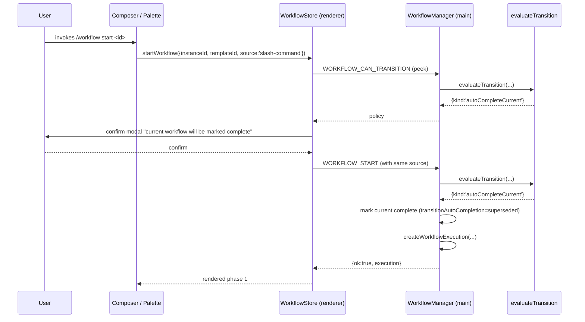
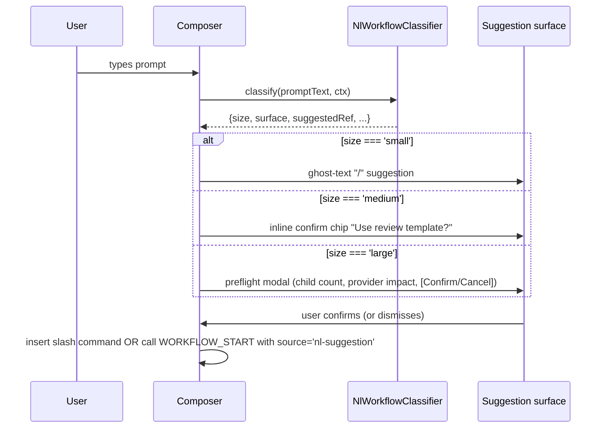
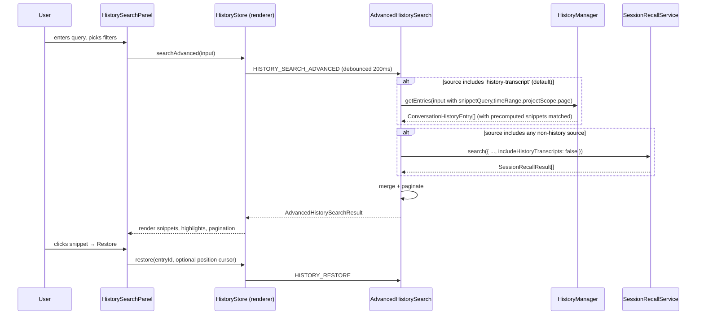

# Wave 3: Workflow, Resume, History & Recovery — Design

**Date:** 2026-04-28
**Status:** Proposed
**Parent design:** [`docs/superpowers/specs/2026-04-28-cross-repo-usability-upgrades-design.md`](./2026-04-28-cross-repo-usability-upgrades-design.md) (Track B — Workflow, Resume, History, And Recovery)
**Parent plan:** [`docs/superpowers/plans/2026-04-28-cross-repo-usability-upgrades-plan.md`](../plans/2026-04-28-cross-repo-usability-upgrades-plan.md) (Wave 3)
**Implementation plan (to follow):** `docs/superpowers/plans/2026-04-28-wave3-workflow-resume-history-recovery-plan.md`
**Wave 1 contracts consumed (treated as available):** `OverlayShellComponent`, `OverlayController<T>`, `UsageStore`/`UsageTracker` (see `docs/superpowers/specs/2026-04-28-wave1-command-registry-and-overlay-design.md`)

## Doc taxonomy in this repo

This spec is one of several artifacts in a multi-wave program. To prevent confusion and doc sprawl:

| Artifact | Folder | Filename pattern | Purpose |
|---|---|---|---|
| **Design / spec** | `docs/superpowers/specs/` | `YYYY-MM-DD-<topic>-design.md` | What we're building, why, how it fits, types & contracts |
| **Plan** | `docs/superpowers/plans/` | `YYYY-MM-DD-<topic>.md` (or `…-plan.md`) | Wave/task breakdown, files to read, exit criteria |
| **Master / roadmap plan** | `docs/superpowers/plans/` | `YYYY-MM-DD-<name>-master-plan.md` | Multi-feature umbrella spanning many specs/plans |
| **Completed**  | either folder | `…_completed.md` suffix | Archived after the work shipped |

This document is a **per-wave child design** of the parent program design. The relationship is:

```
parent design (cross-repo-usability-upgrades-design.md)
  ├── Track A → wave 1 spec  (Command registry & overlay foundation)
  ├── Track A → wave 2 spec  (Navigation, pickers, prompt recall)
  ├── Track B → THIS WAVE 3 SPEC (CHILD)
  ├── Track C → wave 5 spec
  └── Track D → waves 4 & 6 specs

parent plan (cross-repo-usability-upgrades-plan.md)
  └── Wave 3 task list  ←── implemented by this child spec
```

The parent design and plan remain authoritative for cross-track coupling, deferred ideas, and risks; this child design is authoritative for **everything required to implement Wave 3 end to end**.

---

## Goal

Make workflow transitions, history search, session resume, interrupt boundaries, and compaction recovery into explicit, deterministic, operator-visible flows on top of the existing `WorkflowManager`, `HistoryManager`, `SessionRecallService`, `SessionContinuityManager`, and `InterruptRespawnHandler` services. Wave 3 ships:

1. A pure `WorkflowTransitionPolicy` evaluator (`evaluateTransition`) that returns a discriminated-union outcome (`allow` / `allowWithOverlap` / `autoCompleteCurrent` / `deny`) with `reason` and `suggestedAction`. `WorkflowManager.startWorkflow` invokes it synchronously instead of throwing on overlap.
2. Conservative natural-language workflow/skill suggestions: small (slash command suggestion), medium (template confirm), large (preflight modal with child count + provider impact). Suggestion-only — never auto-start.
3. Advanced history search with transcript snippets, project scope, time/source filters, and pagination. Snippets are **precomputed at archive time** and stored on the history entry; full-snippet expansion gunzips the transcript on demand only.
4. `'history-transcript'` added as a new `SessionRecallSource`, gated by `includeHistoryTranscripts`. The advanced-search coordinator delegates to `SessionRecallService` for cross-source recall, leveraging the existing index instead of building a parallel one.
5. Resume picker (Wave 1 overlay) with five actions: `resumeLatest`, `resumeById`, `switchToLive`, `forkNew`, `restoreFromFallback`. Forking generates **both** a new `sessionId` and a new `historyThreadId` to avoid resume-cursor collision.
6. Two new `DisplayItem` kinds: `'interrupt-boundary'` (peer of message; metadata `{ phase, requestId, outcome }`) and `'compaction-summary'` (peer of message; metadata `{ reason, beforeCount, afterCount, fallbackMode }`).

> **This wave critically depends on Wave 1's `OverlayShellComponent`, `OverlayController<T>`, and `UsageStore` being merged.** Phases 1–9 (backend) are independent and can ship before Wave 1 lands. Phases 10–14 (UI: resume picker, history search panel, recovery display items, NL classifier surface) cannot proceed without Wave 1. Implementer should split the work: commit Phases 1–9 first, then merge Wave 1, then commit Phases 10–14.

## Decisions locked from brainstorming

| # | Decision | Rationale |
|---|---|---|
| 1 | `WorkflowTransitionPolicy` is a **discriminated-union return type, not a class hierarchy**. Evaluator is a single pure function `evaluateTransition(current, requested, source) → policy`. | Keeps the policy testable in isolation, avoids an opinionated class API for what is fundamentally a pattern-match. Renderer and main can both call it. No allocation of policy objects per call. |
| 2 | **Snippet indexing = precompute at archive time**, stored in `ConversationHistoryEntry.snippets`. Full-snippet expansion gunzips transcript only on demand. | Per-search gunzip storms over hundreds of archives blow latency budgets. Snippets are written once on archive (we already touch the transcript at that point); index-time read is bounded and cached in the same `HistoryIndex` JSON. |
| 3 | **Search engine = `SessionRecallService` extension**, not a new index. Add `'history-transcript'` as a new `SessionRecallSource` (gated by `includeHistoryTranscripts` query flag). | Avoids a second index to maintain. `SessionRecallService` already merges multiple sources with score+timestamp ranking. Gating by flag keeps the cost knob explicit. |
| 4 | **Policy injection = synchronous pre-flight call** in `WorkflowManager.startWorkflow`. No IPC during evaluation. Atomic phase transition. | Eliminates re-entrance bugs (renderer waiting on main waiting on renderer). Keeps `startWorkflow` deterministic and easy to test. |
| 5 | **Fork semantics = generate both new `sessionId` AND new `historyThreadId`**. Documented explicitly in `ResumeActionsService.forkNew` and `ConversationHistoryEntry` JSDoc. | Sharing either id with the live thread causes resume cursors and history rail keys to collide. Both must change for the new fork to be a fully independent sibling. **Implementation note:** As of today, Wave 3's restore path lives in the `HISTORY_RESTORE` IPC handler (`src/main/ipc/handlers/session-handlers.ts`); there is no `InstanceLifecycle.restoreFromHistory` method. Wave 3 introduces it as a prerequisite (plan Task 8.3a). The new method accepts `opts?: { forkAs?: { sessionId, historyThreadId }; forceFallback?: boolean }`; both new IDs are generated client-side in `resume-actions.service.ts` (or in the resume IPC handler) before invocation. The existing `HISTORY_RESTORE` channel remains wired for backward compatibility. |
| 6 | **Compaction-summary = new `DisplayItem` kind `'compaction-summary'`** (peer of message; system-event-group precedent for styling). Not nested inside `system-event-group`. | A compaction is a transcript-state event the operator must see *between* messages, not a folded-away tool log. Treating it as a peer of message keeps it visible and individually addressable for click/share. |
| 7 | **Interrupt-boundary = new `DisplayItem` kind `'interrupt-boundary'`** with metadata `{ phase, requestId, outcome }`. | Interrupt phases (`requested`, `cancelling`, `escalated`, `respawning`, `completed`) and outcomes (`cancelled`, `cancelled-for-edit`, `respawn-success`, `respawn-fallback`) are already tracked on `Instance` — we only need to project them as a transcript-visible boundary. |
| 8 | **NL workflow activation = suggestion-only, never auto-start.** Always require user confirm. | Matches the parent design's "conservative" requirement; auto-starting templates from natural language is a class of footgun (large workflows can spawn many child sessions). |
| 9 | **NL classification thresholds:** small (≤1 file mentioned, no orchestration keyword) → suggest slash command; medium (multi-file or workflow keyword) → suggest template; large (≥3 children mentioned or `review`/`audit`/`refactor` keyword) → preflight modal. | Heuristic, not ML — debuggable, cheap, locale-friendly. Numbers are spec-locked so behavior is reproducible. |
| 10 | **History snippet schema** = `{ position: number; excerpt: string; score: number }`. Excerpt capped at 240 chars with leading/trailing ellipsis when truncated. | Keeps `HistoryIndex` JSON small (a 100-entry index with up to 5 snippets each is < 200 KB). 240 chars is roughly two lines in the renderer's snippet style. |
| 11 | **Resume picker uses Wave 1 `OverlayShellComponent`** with mode `'resume-picker'`. Actions are buttons in the result-row footer, not a separate menu. | Picker discovery should be one click, not a click-then-menu. Wave 1 already supplies the shell + footer-hint slot. |
| 12 | **Schema placement (verified against current contracts tree):** History and resume IPC schemas extend the existing `packages/contracts/src/schemas/session.schemas.ts` (alias `@contracts/schemas/session` already registered). Workflow IPC schemas live in a NEW `packages/contracts/src/schemas/workflow.schemas.ts`, which **requires the 4-place alias sync** for the new `@contracts/schemas/workflow` subpath per AGENTS.md packaging gotcha #1. The sync points are: `tsconfig.json`, `tsconfig.electron.json`, `src/main/register-aliases.ts`, `vitest.config.ts`. | Verified at draft time: `session.schemas.ts` already exists with a registered alias; `workflow.schemas.ts` does not. Co-locating workflow into `session.schemas.ts` would bloat that file (~30+ new exports) and obscure both. The extra alias is the correct trade. |

## Validation method

The decisions and types in this spec were grounded by reading these files in full prior to drafting:

- Parent docs: `docs/superpowers/specs/2026-04-28-cross-repo-usability-upgrades-design.md`, `docs/superpowers/plans/2026-04-28-cross-repo-usability-upgrades-plan.md`
- Wave 1: `docs/superpowers/specs/2026-04-28-wave1-command-registry-and-overlay-design.md` (overlay shell + controller interface, `UsageStore`)
- Workflow main: `src/main/workflows/workflow-manager.ts` (lines 122–155 for `startWorkflow`, 159–216 for `completePhase`), `src/main/workflows/workflow-persistence.ts`, `src/main/workflows/templates.ts`
- Workflow types: `src/shared/types/workflow.types.ts` (lines 6–132 for the existing `WorkflowExecution` / `WorkflowPhase` / `GateType` model)
- History main: `src/main/history/history-manager.ts` (lines 1–240 for `archiveInstance`, `getEntries`, `loadConversation`)
- History types: `src/shared/types/history.types.ts` (lines 17–80 for `ConversationHistoryEntry`, 287–310 for `HistoryIndex` / `HistoryLoadOptions`)
- History store (renderer): `src/renderer/app/core/state/history.store.ts`
- Recall: `src/main/session/session-recall-service.ts` (lines 1–160 for the multi-source loop), `src/shared/types/session-recall.types.ts` (lines 1–46 for `SessionRecallSource`, `SessionRecallQuery`, `SessionRecallResult`)
- Continuity: `src/main/session/session-continuity.ts` (lines 730–760 for compaction policy emit; line 748 is the `compaction_applied` event we'll project)
- Interrupt lifecycle: `src/main/instance/lifecycle/interrupt-respawn-handler.ts` (lines 1–160 for the three-stage flow + metadata fields)
- Display items: `src/renderer/app/features/instance-detail/display-item-processor.service.ts` (lines 12–36 for the existing `DisplayItem` discriminated union)
- IPC: `src/preload/preload.ts`, `src/preload/domains/session.preload.ts` (lines 119–183 for current `history:*` and `session:resume` channels), `packages/contracts/src/channels/session.channels.ts` (lines 40–55)
- Schemas tree: `packages/contracts/src/schemas/` (no `workflow.schemas.ts` exists today; see § 9.3)

---

## 1. Type model

All new shared types live in `src/shared/types/workflow.types.ts`, `src/shared/types/history.types.ts`, and `src/shared/types/session-recall.types.ts` (existing files extended). Existing fields are unchanged and unprefixed; all new fields are optional.

### 1.1 `WorkflowTransitionPolicy` (discriminated union)

`src/shared/types/workflow.types.ts` adds:

```ts
/**
 * Source of a workflow start request — used by the policy evaluator to apply
 * different rules (e.g. NL suggestions are stricter than explicit slash invocations).
 */
export type WorkflowStartSource =
  | 'slash-command'
  | 'nl-suggestion'
  | 'automation'
  | 'manual-ui'
  | 'restore';

/**
 * Outcome of asking "may we start the requested workflow given the current state?".
 *
 *   allow                — no overlap; start as a fresh execution.
 *   allowWithOverlap     — overlap permitted; caller may start without auto-completing.
 *   autoCompleteCurrent  — caller should mark the active workflow completed
 *                          (with `transitionAutoCompletion` reason) before starting.
 *   deny                 — caller must NOT start. Surface `reason` and (optionally)
 *                          `suggestedAction` to the operator.
 */
export type WorkflowTransitionPolicy =
  | { kind: 'allow' }
  | { kind: 'allowWithOverlap'; maxConcurrent?: number }
  | { kind: 'autoCompleteCurrent' }
  | { kind: 'deny'; reason: string; suggestedAction?: string };

/**
 * Inputs to `evaluateTransition`. The current execution may be `null` when no
 * workflow is active for the instance.
 */
export interface WorkflowTransitionInputs {
  current: {
    execution: WorkflowExecution;
    template: WorkflowTemplate;
  } | null;
  requested: {
    template: WorkflowTemplate;
    instanceId: string;
  };
  source: WorkflowStartSource;
}

/**
 * Pure synchronous evaluator — see `src/main/workflows/workflow-transition-policy.ts`.
 */
export function evaluateTransition(
  inputs: WorkflowTransitionInputs,
): WorkflowTransitionPolicy;
```

### 1.2 `HistorySnippet` and extended `HistoryLoadOptions`

`src/shared/types/history.types.ts` adds:

```ts
/**
 * A precomputed transcript snippet attached to a `ConversationHistoryEntry`.
 *
 * `position` is the buffer index of the message the snippet was extracted from
 * (so the renderer can offer "jump to message" on restore). `excerpt` is a
 * cleaned string capped at 240 chars; truncated edges use a leading/trailing
 * ellipsis. `score` is a relevance number computed at archive time (token-set
 * intersection × recency); used as the default sort key when no query is
 * supplied to advanced search.
 */
export interface HistorySnippet {
  position: number;
  excerpt: string;
  score: number;
}

export type HistorySearchSource =
  | 'history-transcript'
  | 'child_result'
  | 'child_diagnostic'
  | 'automation_run'
  | 'agent_tree'
  | 'archived_session';

/**
 * Time-window filter for advanced history search. `from` and `to` are ms epoch
 * inclusive; either may be omitted to leave that bound open.
 */
export interface HistoryTimeRange {
  from?: number;
  to?: number;
}

/**
 * Project-scope filter for advanced history search. `current` restricts to the
 * caller-supplied `workingDirectory`; `all` ignores project scope; `none`
 * matches entries archived without a working directory.
 */
export type HistoryProjectScope = 'current' | 'all' | 'none';

/**
 * Page cursor for advanced history search. `pageSize` is clamped to [1, 100];
 * `pageNumber` is 1-indexed. The IPC handler returns total counts so the
 * renderer can compute "page X of Y" without re-querying.
 */
export interface HistoryPageRequest {
  pageSize: number;
  pageNumber: number;
}

/**
 * Existing `HistoryLoadOptions` is preserved unchanged; advanced-search adds
 * new fields side-by-side.
 */
export interface HistoryLoadOptions {
  // ── existing ──
  limit?: number;
  searchQuery?: string;
  workingDirectory?: string;

  // ── Wave 3 additions (all optional) ──
  /** When set, also matches against transcript snippets (precomputed at archive). */
  snippetQuery?: string;

  /** Wall-clock filter applied to `endedAt`. */
  timeRange?: HistoryTimeRange;

  /** Restrict by source. `'history-transcript'` is the default for plain text. */
  source?: HistorySearchSource | HistorySearchSource[];

  /** Project scope filter. Defaults to `'current'` when `workingDirectory` is set. */
  projectScope?: HistoryProjectScope;

  /** Pagination request. When omitted, the existing `limit` semantics apply. */
  page?: HistoryPageRequest;
}

/**
 * Extension to `ConversationHistoryEntry` (no breaking changes).
 */
export interface ConversationHistoryEntry {
  // ── existing fields unchanged ──
  // ...

  /** Precomputed transcript snippets for advanced search. Capped at 5 per entry. */
  snippets?: HistorySnippet[];
}
```

`HistorySearchSource` intentionally aliases `SessionRecallSource` plus the new `'history-transcript'` member — the advanced-search coordinator translates between the two type spaces (see § 7.4).

### 1.3 New `SessionRecallSource` member

`src/shared/types/session-recall.types.ts` extends `SessionRecallSource`:

```ts
export type SessionRecallSource =
  | 'history-transcript'   // ← NEW (Wave 3): transcript snippets from archived history
  | 'child_result'
  | 'child_diagnostic'
  | 'automation_run'
  | 'provider_event'
  | 'agent_tree'
  | 'archived_session';
```

`SessionRecallQuery` is also extended with two cost-control flags (so callers must opt in to transcript scanning):

```ts
export interface SessionRecallQuery {
  // ── existing fields unchanged ──
  query: string;
  intent?: SessionRecallIntent;
  parentId?: string;
  automationId?: string;
  provider?: string;
  model?: string;
  repositoryPath?: string;
  sources?: SessionRecallSource[];
  limit?: number;

  // ── Wave 3 additions ──
  /** Opt in to scanning history-transcript snippets. Defaults to `false`. */
  includeHistoryTranscripts?: boolean;

  /** Cap on history-transcript results merged into the union. Defaults to 25. */
  maxHistoryTranscriptResults?: number;
}
```

`SessionRecallResult.metadata` for `'history-transcript'` results carries `{ entryId, position, excerpt }` so the renderer can resume directly from the matched message.

**Dedup contract:** Only `'history-transcript'` results carry `metadata.entryId`. Other recall source kinds (`'child_result'`, `'child_diagnostic'`, `'automation_run'`, `'provider_event'`, `'agent_tree'`, `'archived_session'`) use their own primary keys (`resultId`, `diagnosticId`, `automationRunId`, etc.) and are NOT deduplicated against history results. `AdvancedHistorySearch.dedupResults()` (plan Task 7.2) keys exclusively on `entryId` for this reason. If a future source kind adds `entryId` to its metadata, the dedup must be scoped by source kind to avoid false collisions.

### 1.4 New `DisplayItem` kinds

`src/renderer/app/features/instance-detail/display-item-processor.service.ts` extends the `type` union:

```ts
export interface DisplayItem {
  id: string;
  type:
    | 'message'
    | 'tool-group'
    | 'thought-group'
    | 'work-cycle'
    | 'system-event-group'
    | 'interrupt-boundary'   // ← NEW (Wave 3)
    | 'compaction-summary';  // ← NEW (Wave 3)

  // ── existing fields unchanged ──
  // ...

  /** When type === 'interrupt-boundary', boundary metadata. */
  interruptBoundary?: InterruptBoundaryDisplay;

  /** When type === 'compaction-summary', summary metadata. */
  compactionSummary?: CompactionSummaryDisplay;
}

/**
 * Phases come from `Instance.interruptPhase`; outcomes are derived in the
 * renderer so they can be visually distinct from phase transitions.
 */
export type InterruptDisplayPhase =
  | 'requested'
  | 'cancelling'
  | 'escalated'
  | 'respawning'
  | 'completed';

export type InterruptDisplayOutcome =
  | 'cancelled'
  | 'cancelled-for-edit'
  | 'respawn-success'
  | 'respawn-fallback'
  | 'unresolved';

export interface InterruptBoundaryDisplay {
  phase: InterruptDisplayPhase;
  requestId: string;
  outcome: InterruptDisplayOutcome;
  /** ms epoch when the boundary was emitted. */
  at: number;
  /** Optional human reason ("user pressed Esc", "edit-and-resend", etc). */
  reason?: string;
  /** Resume mode if the outcome was `respawn-fallback`. */
  fallbackMode?: 'native-resume' | 'resume-unconfirmed' | 'replay-fallback';
}

export type CompactionFallbackMode =
  | 'in-place'
  | 'snapshot-restore'
  | 'native-resume'
  | 'replay-fallback';

export interface CompactionSummaryDisplay {
  reason: string;                    // e.g. "context budget", "manual /compact"
  beforeCount: number;                // message count before compaction
  afterCount: number;                 // message count after compaction
  tokensReclaimed?: number;
  fallbackMode?: CompactionFallbackMode;
  at: number;                         // ms epoch
}
```

### 1.5 `ResumePickerAction` and `ResumePickerItem`

New file (renderer): `src/renderer/app/features/resume/resume-picker.types.ts`.

```ts
export type ResumePickerAction =
  | 'resumeLatest'             // resume the most-recent thread for the active project
  | 'resumeById'               // resume an explicit id (for power users / palette deeplink)
  | 'switchToLive'             // already-live thread: focus its existing instance
  | 'forkNew'                  // new sessionId + new historyThreadId; copies transcript
  | 'restoreFromFallback';     // use replay-fallback when native resume fails

export interface ResumePickerItem {
  id: string;                          // history entry id OR live instance id
  kind: 'archived' | 'live';
  title: string;
  workingDirectory: string;
  endedAt: number;
  /** Frecency rank precomputed via `UsageStore.frecency('resume:' + id)`. */
  rank?: number;
  /** Action availability matrix — controllers gate on this. */
  availableActions: ResumePickerAction[];
  metadata: {
    provider?: string;
    currentModel?: string;
    snippets?: HistorySnippet[];
    historyThreadId?: string;
    nativeResumeFailedAt?: number | null;
  };
}
```

---

## 2. Service signatures

### 2.1 `WorkflowTransitionPolicy.evaluate`

**New file:** `src/main/workflows/workflow-transition-policy.ts`. Pure module — no class, no singleton.

```ts
import type {
  WorkflowExecution,
  WorkflowTemplate,
  WorkflowTransitionInputs,
  WorkflowTransitionPolicy,
} from '../../shared/types/workflow.types';

export function evaluateTransition(
  inputs: WorkflowTransitionInputs,
): WorkflowTransitionPolicy;

/** Optional helper: same result, classified into a "category" for telemetry. */
export type WorkflowOverlapCategory =
  | 'no-overlap'
  | 'compatible'
  | 'incompatible'
  | 'superseding'
  | 'blocked';

export function classifyOverlap(
  inputs: WorkflowTransitionInputs,
): WorkflowOverlapCategory;
```

#### Decision rules (verbatim implementation contract)

1. **No active workflow** (`inputs.current === null`) → `{ kind: 'allow' }`.
2. **Self-overlap** (active execution's `templateId` equals requested template id, same instance) → `{ kind: 'deny', reason: 'Workflow {name} is already active.', suggestedAction: 'switch-to-pending-gate' | 'cancel-current' }`.
3. **Active execution complete** (`current.execution.completedAt` set) → `{ kind: 'allow' }` (the existing instance association is stale; treat as no overlap).
4. **Active execution awaiting gate** (`current.execution.pendingGate` set) AND requested source is `'nl-suggestion'` → `{ kind: 'deny', reason: 'Active workflow is awaiting your input on phase {phaseId}. Resolve it first.', suggestedAction: 'open-active-gate' }`.
5. **Categories are siblings** (e.g. both `category: 'review'`) → `{ kind: 'autoCompleteCurrent' }` (the new run supersedes the old; caller marks current completed).
6. **Categories are mutually compatible per the matrix below** → `{ kind: 'allowWithOverlap', maxConcurrent: 2 }`.
7. **Categories are mutually incompatible** → `{ kind: 'deny', reason: 'Cannot run {a} workflow while {b} workflow is active.', suggestedAction: 'cancel-current' | 'wait' }`.
8. **`source === 'restore'`** short-circuits to `{ kind: 'allow' }` regardless of overlap (restore is always idempotent).
9. **`source === 'automation'`** with overlap **never** auto-completes; it is restricted to `allow` or `deny` (avoids non-deterministic operator surprise from background automations).

Compatibility matrix (current vs. requested template `category`):

|                | development | review | debugging | custom |
|---|---|---|---|---|
| **development** | autoCompleteCurrent | allowWithOverlap | allowWithOverlap | allowWithOverlap |
| **review**      | allowWithOverlap | autoCompleteCurrent | allowWithOverlap | allowWithOverlap |
| **debugging**   | allowWithOverlap | allowWithOverlap | autoCompleteCurrent | allowWithOverlap |
| **custom**      | allowWithOverlap | allowWithOverlap | allowWithOverlap | autoCompleteCurrent |

> "custom" is the WorkflowTemplate `category` for user-authored templates. Sibling-category collisions auto-complete; cross-category collisions overlap.

The evaluator does not mutate any input. It does not log. It is safe to call in renderer code (e.g. for previewing a Start Workflow button's enabled state) and in main code (for the policy gate inside `startWorkflow`).

### 2.2 `WorkflowManager.startWorkflow` policy hook

`src/main/workflows/workflow-manager.ts` — `startWorkflow` becomes:

```ts
public startWorkflow(
  instanceId: string,
  templateId: string,
  source: WorkflowStartSource = 'manual-ui',
): WorkflowExecution {
  const requested = this.templates.get(templateId);
  if (!requested) throw new Error(`Template not found: ${templateId}`);

  const currentId = this.instanceExecutions.get(instanceId);
  const currentExecution = currentId ? this.executions.get(currentId) : undefined;
  const currentTemplate = currentExecution
    ? this.templates.get(currentExecution.templateId)
    : undefined;

  const policy = evaluateTransition({
    current: currentExecution && currentTemplate
      ? { execution: currentExecution, template: currentTemplate }
      : null,
    requested: { template: requested, instanceId },
    source,
  });

  if (policy.kind === 'deny') {
    const err = new WorkflowTransitionDenied(
      `Cannot start ${requested.name}: ${policy.reason}`,
      policy,
    );
    this.emit('workflow:transition-denied', { policy, requested, source });
    throw err;
  }

  if (policy.kind === 'autoCompleteCurrent' && currentExecution && !currentExecution.completedAt) {
    currentExecution.completedAt = Date.now();
    currentExecution.transitionAutoCompletion = { reason: 'superseded', supersededBy: requested.id };
    this.persistExecution(currentExecution);
    this.emit('workflow:auto-completed', { execution: currentExecution, supersededBy: requested.id });
    this.instanceExecutions.delete(instanceId);
  }

  // Existing creation logic continues unchanged…
  const execution = createWorkflowExecution(instanceId, templateId, requested);
  this.executions.set(execution.id, execution);
  this.instanceExecutions.set(instanceId, execution.id);
  this.persistExecution(execution);
  this.emit('workflow:started', { execution, template: requested, policy });
  // …phase agent launch unchanged…
  return execution;
}
```

`WorkflowTransitionDenied` is a typed `Error` subclass with `policy: Extract<WorkflowTransitionPolicy, { kind: 'deny' }>` so IPC handlers can serialize the deny reason without sniffing the message string.

`transitionAutoCompletion` is a new optional field on `WorkflowExecution`:

```ts
export interface WorkflowExecution {
  // ── existing fields unchanged ──
  // ...
  transitionAutoCompletion?: {
    reason: 'superseded' | 'manual-cancel' | 'restore-cleanup';
    supersededBy?: string;
  };
}
```

### 2.3 `TranscriptSnippetService`

**New file:** `src/main/history/transcript-snippet-service.ts`.

```ts
export interface SnippetExtractionInput {
  messages: OutputMessage[];
  /** Search query used to score snippets at archive time. Defaults to ''. */
  query?: string;
  /** Cap on snippets per entry. Defaults to 5. */
  maxSnippets?: number;
  /** Cap on excerpt length in chars. Defaults to 240. */
  maxExcerptChars?: number;
}

export interface TranscriptSnippetService {
  /** Pure (no IO). Used by `archiveInstance` to fill `entry.snippets`. */
  extractAtArchiveTime(input: SnippetExtractionInput): HistorySnippet[];

  /** Loads a gzipped transcript by entryId and runs an on-demand re-score
   *  for full-snippet expansion in the renderer. Used only when the
   *  precomputed snippets aren't enough (e.g. snippetQuery doesn't match any
   *  precomputed snippet but the user wants to drill in). */
  expandSnippetsOnDemand(
    entryId: string,
    query: string,
    opts?: { maxSnippets?: number; maxExcerptChars?: number },
  ): Promise<HistorySnippet[]>;
}

export function getTranscriptSnippetService(): TranscriptSnippetService;
export function _resetTranscriptSnippetServiceForTesting(): void;
```

Singleton + `_resetForTesting()` per project pattern.

#### Snippet extraction algorithm (deterministic)

1. Filter to user + assistant messages only (skip tool/system events).
2. Tokenize content (lowercase, split on `\W+`, drop tokens < 3 chars).
3. If `query` is empty → score by recency only (newer messages score higher).
4. If `query` is non-empty → score = `tokenSetIntersection(messageTokens, queryTokens) * recencyDecay`.
5. Sort by score desc; take top `maxSnippets`.
6. Build `excerpt`: take a 240-char window centered on the highest-scoring token; ellipsis-trim edges; collapse whitespace.

The on-demand path gunzips the transcript via `HistoryManager.loadConversation(entryId)` and feeds the messages back through the same extractor with the runtime `query`.

**Performance posture:** `extractAtArchiveTime` is synchronous and O(n log n) where n = filtered message count. For typical archives (<1,000 messages) this is sub-millisecond. For large archives (>5,000 messages) the call may exceed 50ms and impact archive throughput. Wave 3 ships the synchronous version as the simplest correct implementation; benchmarking and optional move to a worker thread or `setImmediate`-deferred extraction is captured as a non-blocking follow-up (plan Phase 4 Task 4.5). If observed archive latency regresses, the follow-up is pulled forward.

### 2.4 `AdvancedHistorySearch`

**New file:** `src/main/history/advanced-history-search.ts`.

```ts
export interface AdvancedHistorySearchInput {
  searchQuery?: string;       // matches metadata: displayName, first/last user msg, working dir
  snippetQuery?: string;       // matches transcript snippets (precomputed)
  workingDirectory?: string;
  projectScope?: HistoryProjectScope;     // default 'current' when workingDirectory is set
  source?: HistorySearchSource | HistorySearchSource[];
  timeRange?: HistoryTimeRange;
  page?: HistoryPageRequest;
}

export interface AdvancedHistorySearchResult {
  entries: ConversationHistoryEntry[];
  recallResults: SessionRecallResult[];   // contributed by SessionRecallService when source includes recall sources
  page: { pageNumber: number; pageSize: number; totalCount: number; totalPages: number };
}

export interface AdvancedHistorySearch {
  search(input: AdvancedHistorySearchInput): Promise<AdvancedHistorySearchResult>;
}

export function getAdvancedHistorySearch(): AdvancedHistorySearch;
export function _resetAdvancedHistorySearchForTesting(): void;
```

The coordinator owns:
- Translating `source: HistorySearchSource[]` into the right delegate calls.
- Calling `HistoryManager.getEntries` for `'history-transcript'` (passing `snippetQuery` and the new options).
- Calling `SessionRecallService.search(...)` with `includeHistoryTranscripts: true` when `source` includes any non-history-transcript value.
- Merging, deduplicating (by `entryId`), and paginating.

### 2.5 `NlWorkflowClassifier`

**New file:** `src/main/session/nl-workflow-classifier.ts`.

```ts
export type NlWorkflowSize = 'small' | 'medium' | 'large';

export interface NlWorkflowSuggestion {
  size: NlWorkflowSize;
  /** Suggested action surface — controllers map this to the right UI. */
  surface: 'slash-command' | 'template-confirm' | 'preflight-modal';
  /** Suggested template id for medium/large. Slash command name for small. */
  suggestedRef: string | null;
  /** Heuristic reasons captured for telemetry / Doctor; never shown raw. */
  matchedSignals: NlWorkflowSignal[];
  /** Estimate from the heuristic for the preflight modal. */
  estimatedChildCount?: number;
  estimatedProviderImpact?: 'none' | 'low' | 'medium' | 'high';
}

export type NlWorkflowSignal =
  | 'mentions-multiple-files'
  | 'mentions-three-or-more-children'
  | 'workflow-keyword-review'
  | 'workflow-keyword-audit'
  | 'workflow-keyword-refactor'
  | 'workflow-keyword-debug'
  | 'workflow-keyword-feature'
  | 'orchestration-mention'
  | 'no-orchestration-mention';

export interface NlWorkflowClassifier {
  classify(promptText: string, context: { provider?: string; workingDirectory?: string }): NlWorkflowSuggestion;
}

export function getNlWorkflowClassifier(): NlWorkflowClassifier;
export function _resetNlWorkflowClassifierForTesting(): void;
```

#### Heuristic (pure, deterministic)

```
small:
  - matched signals contains 'no-orchestration-mention'
  - file mentions count <= 1
  - no workflow keyword
  → suggest slash command (e.g. `/explain` or `/review-quick`)

medium:
  - matched signals contains a workflow keyword (review/audit/refactor/debug/feature)
    OR file mentions count > 1
  - mentioned children count < 3
  → suggest template confirm

large:
  - mentioned children count >= 3
    OR matched signals contains 'workflow-keyword-review' AND 'mentions-multiple-files'
    OR prompt length > 1000 chars AND any workflow keyword
  → preflight modal with child count + provider impact
```

`mentions-multiple-files` is matched by counting `(?:\b|^)([\/.]?[\w./-]+\.[a-z]{1,5})\b` regex hits with > 1; `three-or-more-children` matches `\b\d+\s+(?:children|agents|reviewers|verifiers)\b` with capture ≥ 3.

The classifier never makes IPC calls and never reads disk.

### 2.6 `ResumeActionsService` and `ResumePickerController`

**New files:**
- Renderer: `src/renderer/app/features/resume/resume-actions.service.ts` (IPC bridge)
- Renderer: `src/renderer/app/features/resume/resume-picker.controller.ts` (Wave 1 `OverlayController<ResumePickerItem>`)

```ts
@Injectable({ providedIn: 'root' })
export class ResumeActionsService {
  resumeLatest(workingDirectory: string | null): Promise<{ ok: true; instanceId: string } | IpcError>;
  resumeById(entryId: string): Promise<{ ok: true; instanceId: string } | IpcError>;
  switchToLive(instanceId: string): Promise<{ ok: true } | IpcError>;
  forkNew(entryId: string): Promise<{ ok: true; instanceId: string; newSessionId: string; newHistoryThreadId: string } | IpcError>;
  restoreFromFallback(entryId: string): Promise<{ ok: true; instanceId: string; restoreMode: HistoryRestoreMode } | IpcError>;
}

@Injectable({ providedIn: 'root' })
export class ResumePickerController implements OverlayController<ResumePickerItem> {
  readonly id = 'resume-picker';
  readonly modeLabel = 'Resume';
  readonly placeholder = 'Search threads to resume…';
  // groups, query, lastError, etc. per Wave 1 contract
}
```

The controller:
- Loads candidate items from `HistoryStore.advancedSearch(...)` (live + archived merged).
- Ranks via `UsageStore.frecency('resume:' + id, projectPath)`.
- Renders five action buttons in the result-row footer (`OverlayShellComponent`'s footer hint slot from Wave 1, augmented with a result-row footer projection — see § 5.3 for the small Wave 1 input added).
- Calls `ResumeActionsService` per button. Updates `lastError` on failure.

### 2.7 IPC contract additions

| Channel | Direction | Payload | Response |
|---|---|---|---|
| `WORKFLOW_CAN_TRANSITION` | renderer → main | `{ instanceId: string; templateId: string; source: WorkflowStartSource }` | `WorkflowTransitionPolicy` |
| `WORKFLOW_START` (modified) | renderer → main | `{ instanceId; templateId; source: WorkflowStartSource }` | `{ ok: true; execution } | { ok: false; policy: WorkflowTransitionPolicy }` |
| `HISTORY_SEARCH_ADVANCED` | renderer → main | `AdvancedHistorySearchInput` | `AdvancedHistorySearchResult` |
| `HISTORY_EXPAND_SNIPPETS` | renderer → main | `{ entryId: string; query: string }` | `HistorySnippet[]` |
| `RESUME_LATEST` | renderer → main | `{ workingDirectory?: string }` | `{ ok: true; instanceId: string }` |
| `RESUME_BY_ID` | renderer → main | `{ entryId: string }` | `{ ok: true; instanceId: string }` |
| `RESUME_SWITCH_TO_LIVE` | renderer → main | `{ instanceId: string }` | `{ ok: true }` |
| `RESUME_FORK_NEW` | renderer → main | `{ entryId: string }` | `{ ok: true; instanceId: string; newSessionId: string; newHistoryThreadId: string }` |
| `RESUME_RESTORE_FALLBACK` | renderer → main | `{ entryId: string }` | `{ ok: true; instanceId: string; restoreMode: HistoryRestoreMode }` |
| `WORKFLOW_NL_SUGGEST` | renderer → main | `{ promptText: string; provider?: string; workingDirectory?: string }` | `NlWorkflowSuggestion` |

Existing `HISTORY_LIST` is preserved (for the rail's simple metadata view). The advanced UI uses `HISTORY_SEARCH_ADVANCED`.

---

## 3. Workflow transition flows

### 3.1 Start workflow with overlap



`WORKFLOW_CAN_TRANSITION` is the safe peek path used by UI affordances (button enabled state, palette deny tooltips). `WORKFLOW_START` re-runs the policy at submit time so the result is always atomic with the persisted execution.

### 3.2 NL suggestion flow



The classifier never auto-starts a workflow. The suggestion surface always surfaces a confirm gesture before any IPC call.

---

## 4. Advanced history search flow



#### Snippet precompute & on-demand expand

1. `archiveInstance` calls `TranscriptSnippetService.extractAtArchiveTime({messages, query: ''})` and writes `entry.snippets` (top 5).
2. Advanced search surfaces those snippets directly when `snippetQuery` doesn't match precomputed positions.
3. When the user runs a free-text `snippetQuery`, the search first matches against `entry.snippets[].excerpt`. If hits per entry < 3, the panel offers an "Expand snippets" affordance that calls `HISTORY_EXPAND_SNIPPETS` to gunzip and re-score on demand. Snippets discovered on demand are not written back to `entry.snippets` (precompute is canonical).

---

## 5. UI flows

### 5.1 Resume picker

The picker is opened from `Cmd/Ctrl+R` (new keybinding action `resume.openPicker`) or via the new `/resume` builtin command. The Wave 1 overlay shell renders the controller's groups: `Live`, `Recent (this project)`, `Recent (all projects)`, `Fallback recoveries`.

Each result row renders five action buttons (or fewer, gated by `availableActions`) in the row footer:

```
┌───────────────────────────────────────────────────┐
│  refactor history manager                         │
│  ~/work/orchestrat0r/ai-orchestrator              │
│  ended 2h ago • claude-sonnet-4 • 132 messages    │
│  ┌───────────────┐ ┌──────┐ ┌─────────┐ ┌───────┐ │
│  │ Resume latest │ │ Fork │ │ Live ↗  │ │ Fallback│
│  └───────────────┘ └──────┘ └─────────┘ └───────┘ │
└───────────────────────────────────────────────────┘
```

`OverlayShellComponent` gains one new optional input in this wave: a `<ng-content select="[itemFooter]">` projection slot rendered inside each row. (The existing Wave 1 footer-hint surface is the *bottom* of the overlay; the per-row footer is for picker-specific actions.) This is a small additive change to Wave 1's component contract; documented in § 9.4.

### 5.2 Advanced history search panel

A new top-level renderer feature: `src/renderer/app/features/history/history-search-panel.component.ts`. Standalone, OnPush, signals-only.

Layout:
- Top bar: `searchQuery` input, `snippetQuery` input, `time range` chips (today, yesterday, last week, custom), `source` chips, `project scope` toggle (`Current` / `All`).
- Main: result list — each row shows entry header + up to 3 highlighted snippet excerpts, with "Restore" / "Open in resume picker" / "Show more snippets" actions.
- Footer: pagination controls (`pageSize` 10/25/50, "Page X of Y").

Highlighting is renderer-side: the panel splits each snippet excerpt around case-insensitive `snippetQuery` token boundaries and wraps matches in `<mark>`.

### 5.3 Workflow start with overlap

When `evaluateTransition` returns `autoCompleteCurrent` or `deny`, the start surface (palette or composer) renders an inline confirm/explanation card before submitting. The card uses Wave 1's `OverlayController.lastError` slot when surfaced from the palette, or a dedicated banner when surfaced from the composer.

| Policy | UI surface | Confirm copy |
|---|---|---|
| `allow` | none — start immediately | — |
| `allowWithOverlap` | non-blocking toast "Started alongside <current>" | — |
| `autoCompleteCurrent` | inline confirm card "Marking <current> complete to start <new>. Continue?" | Confirm / Cancel |
| `deny` | inline error banner with `policy.reason` and `policy.suggestedAction` button (e.g. "Open active gate") | suggested action button |

### 5.4 Interrupt-boundary rendering

`InterruptRespawnHandler` already maintains `interruptRequestId`, `interruptPhase`, and `lastTurnOutcome` on `Instance`. Wave 3 adds a thin emitter at each phase transition:

```ts
// in InterruptRespawnHandler (illustrative — see plan task)
this.deps.emitDisplayMarker?.(instanceId, {
  kind: 'interrupt-boundary',
  phase: 'requested' | 'cancelling' | 'escalated' | 'respawning' | 'completed',
  requestId,
  outcome: …,
  reason: …,
});
```

`emitDisplayMarker` is a new optional dep on `InterruptRespawnDeps` so existing tests continue to work without wiring it. The renderer side adds a `'interrupt-boundary'` branch in `DisplayItemProcessor.process` that consumes the marker and emits a peer-of-message item.

Visual:

```
─── interrupt requested 12:04:11 ───
─── cancelled (turn 17) ───
─── respawning, native resume ───
─── recovered, fresh session 12:04:13 ───
```

### 5.5 Compaction-summary rendering

`SessionContinuityManager` already emits a `compaction_applied` session event (line 748) and a `session:compacting` EventEmitter event (line 752). Wave 3 wraps that in a structured display marker:

```ts
// in SessionContinuityManager.maybeCompact (illustrative — see plan task)
this.emit('session:compaction-display', {
  instanceId,
  reason: decision.reason,
  beforeCount: messageCountBeforeCompaction,
  afterCount: state.conversationHistory.length,
  tokensReclaimed: state.contextUsage.used - newUsed,
  fallbackMode: 'in-place',
});
```

A new main-side renderer module `src/main/display-items/compaction-summary-renderer.ts` listens to this event and pushes an `OutputMessage` of `type: 'system'` with `metadata.kind = 'compaction-summary'` into the instance buffer (so it survives archival into history). The renderer's `DisplayItemProcessor` recognizes the metadata and projects it as a `'compaction-summary'` display item.

Visual:

```
┌─ Conversation compacted ───────────────────────────┐
│  Reason: context budget                             │
│  120 messages → 32 messages • 18,400 tokens freed   │
└─────────────────────────────────────────────────────┘
```

---

## 6. Schema and IPC alignment

### 6.1 Schema additions

We **intentionally avoid** adding a new `@contracts/schemas/*` subpath in this wave. The packaging gotcha #1 (`tsconfig.json`, `tsconfig.electron.json`, `register-aliases.ts`, `vitest.config.ts` 4-place sync) costs a meaningful chunk of risk for a wave that only adds a handful of schemas. Instead:

- New workflow IPC schemas live in **a new `packages/contracts/src/schemas/workflow.schemas.ts`** importable through the existing `@contracts/schemas/workflow` resolver pattern *if and only if* a similar alias already exists for an adjacent schema. If no alias is present, the schemas are imported via the package-level export from `@contracts/schemas` and the implementer **does not** add a new subpath.
- New history-search schemas extend `packages/contracts/src/schemas/session.schemas.ts`.
- Channels go in `packages/contracts/src/channels/session.channels.ts` (HISTORY_SEARCH_ADVANCED, HISTORY_EXPAND_SNIPPETS, RESUME_*) and a new `packages/contracts/src/channels/workflow.channels.ts` (WORKFLOW_CAN_TRANSITION, WORKFLOW_NL_SUGGEST).

Verification: the implementer adds a checklist task to confirm `npx tsc --noEmit` resolves all imports from `src/main/` AND `src/renderer/` AND `tsconfig.spec.json` after the schema additions. If any of those fail because the schemas needed an alias, the 4-place sync is added at that point and called out explicitly in the commit message.

### 6.2 Preload exposure

`src/preload/domains/session.preload.ts` adds:

```ts
searchHistoryAdvanced: (input: AdvancedHistorySearchInput) =>
  ipcRenderer.invoke(ch.HISTORY_SEARCH_ADVANCED, input),
expandHistorySnippets: (entryId: string, query: string) =>
  ipcRenderer.invoke(ch.HISTORY_EXPAND_SNIPPETS, { entryId, query }),
resumeLatest: (workingDirectory?: string) =>
  ipcRenderer.invoke(ch.RESUME_LATEST, { workingDirectory }),
resumeById: (entryId: string) =>
  ipcRenderer.invoke(ch.RESUME_BY_ID, { entryId }),
switchToLive: (instanceId: string) =>
  ipcRenderer.invoke(ch.RESUME_SWITCH_TO_LIVE, { instanceId }),
forkNew: (entryId: string) =>
  ipcRenderer.invoke(ch.RESUME_FORK_NEW, { entryId }),
restoreFromFallback: (entryId: string) =>
  ipcRenderer.invoke(ch.RESUME_RESTORE_FALLBACK, { entryId }),
```

A new `workflow` preload domain is added as `src/preload/domains/workflow.preload.ts` — the existing `session.preload.ts` does not currently host workflow IPC, and adding a workflow domain mirrors the existing one-domain-per-area convention (`automation`, `orchestration`, etc.).

---

## 7. Testing strategy

### 7.1 Pure-function tests (unit, fast)

- `src/main/workflows/__tests__/workflow-transition-policy.spec.ts`
  - all 9 decision rules (one test per row of § 2.1's truth table)
  - the 4×4 compatibility matrix
  - source-restricted behaviors (`automation` never auto-completes; `restore` always allows; `nl-suggestion` blocks on pending gate)
- `src/main/history/__tests__/transcript-snippet-service.spec.ts`
  - empty messages → empty snippets
  - empty query → recency-only ranking
  - non-empty query → token-set scoring
  - excerpt truncation with leading + trailing ellipsis
  - max 5 snippets enforced
- `src/main/session/__tests__/nl-workflow-classifier.spec.ts`
  - small/medium/large boundary cases
  - keyword detection (review/audit/refactor/debug/feature)
  - file-mention regex correctness (windows paths, relative paths)
  - child-count regex correctness

### 7.2 Integration tests (vitest, mocked persistence)

- `src/main/workflows/__tests__/workflow-manager-policy-integration.spec.ts`
  - `WorkflowManager.startWorkflow` policy hook end-to-end
  - `autoCompleteCurrent` actually marks current complete with `transitionAutoCompletion`
  - `deny` throws `WorkflowTransitionDenied`
  - `allow` is the existing happy path
- `src/main/history/__tests__/history-manager-snippets.spec.ts`
  - `archiveInstance` writes `snippets` on the index entry
  - `getEntries` paginates correctly
  - `getEntries` honors `timeRange`, `projectScope`, `source` filters
- `src/main/history/__tests__/advanced-history-search.spec.ts`
  - history-transcript-only path
  - mixed-source path delegates to `SessionRecallService`
  - dedup by `entryId` across sources

### 7.3 Renderer tests

- `src/renderer/app/core/state/__tests__/history.store.advanced-search.spec.ts`
- `src/renderer/app/features/resume/__tests__/resume-picker.controller.spec.ts`
- `src/renderer/app/features/instance-detail/__tests__/display-item-processor.interrupt-boundary.spec.ts`
- `src/renderer/app/features/instance-detail/__tests__/display-item-processor.compaction-summary.spec.ts`

### 7.4 Manual smoke

- Start workflow A while workflow B is active, in same category → confirm card appears, on confirm B is marked completed with `superseded` and A starts.
- NL prompt: "review this PR for security issues" with 4 file mentions → preflight modal shows expected child count.
- Advanced history search: query against current project, snippet query "auth bug", time range last week → snippets render with highlighting.
- Resume picker: pick a thread that previously failed native resume → only `Restore from fallback` button appears in row footer.
- Interrupt during agent turn → transcript shows `interrupt requested` → `cancelled` boundary line.
- Hit context budget → transcript shows compaction summary card with before/after counts; counts persist across restart.

---

## 8. Risks

| Risk | Likelihood | Impact | Mitigation |
|---|---|---|---|
| Search performance (gunzip storms) | High | High | Precompute snippets at archive time; gunzip only on user-initiated expansion. Hard cap of 5 snippets per entry. |
| IPC payload size for large pages | Med | Med | Page size clamped to 100; results omit full transcripts (only metadata + snippets). |
| `SessionRecallService` cost when transcripts joined | Med | Med | `includeHistoryTranscripts` defaults to `false`; advanced search is the only opt-in caller. |
| Privacy of transcript snippets in search index | Med | Med | Snippets are local-only (in `HistoryIndex` JSON inside `userData/conversation-history/index.json`); export bundles must redact unless explicitly opted in. Documented in § 8.2. |
| State machine reentrance: policy evaluation racing with concurrent `startWorkflow` | Low | High | Policy is synchronous; main process is single-threaded; `WorkflowManager.startWorkflow` is non-`async`. |
| Resume fork id collision (sessionId reuse breaks resume cursor) | Med | High | Locked decision #5: forks generate **both** new sessionId AND new historyThreadId. Test pins the invariant. |
| `'compaction-summary'` collides with `system-event-group` | Low | Med | Locked decision #6: peer of message, not nested. `DisplayItemProcessor` branches on `metadata.kind` *before* the system-event-group grouping pass. |
| NL classifier misfires (suggests review template when user wanted to chat) | Med | Low | Suggestion-only (locked decision #8) + dismissible. Heuristic thresholds stable in tests. Operator can disable suggestions per-instance in settings (parent design's deferred toggle). |
| Snippet schema bloats `HistoryIndex` JSON | Low | Med | Cap at 5 snippets × 240 chars ≈ 1.2KB per entry; 100-entry index ≈ 120KB worst case. Acceptable. |
| Policy rules drift from operator expectation | Med | Low | Decision rules are version-printed in `WorkflowTransitionPolicy` evaluator JSDoc; alternative behaviors deferred to a "policy preference" setting (out of scope). |
| Wave 1 contracts not yet shipped when Wave 3 starts | High (real) | High | Plan opens with type-only Phase 1; renderer Phases 9–13 explicitly note they consume Wave 1's `OverlayShellComponent` / `OverlayController` / `UsageStore` — implementer must verify Wave 1 is merged before starting Phase 10. |

### 8.1 Known follow-ups (out of scope for Wave 3)

- Doctor surfaces of `WorkflowTransitionDenied` events (Wave 6).
- Server-side full-text index for transcripts (deferred — `archiveInstance` snippet precompute is enough for now).
- Per-project NL suggestion preferences (settings panel, parent design).
- Explicit "merge two threads" action on the resume picker (out of scope).
- **Telemetry feedback loop for NL classifier thresholds** (plan Task 13.4): emit signals + acted-on events to enable threshold refinement post-ship. Wave 6 Doctor surfaces accumulated stats.

### 8.2 Privacy posture

- All transcript snippets and search indexes are stored in `userData/conversation-history/` and never leave the local machine.
- The existing `session.share-replay` flow explicitly redacts before export; the new advanced-search panel uses the same redaction pipeline before any "share results" action (added in Wave 4 — Wave 3 ships search without share).

---

## 9. File-by-file change inventory

### 9.1 Created

| Path | Purpose |
|---|---|
| `src/main/workflows/workflow-transition-policy.ts` | Pure `evaluateTransition` + `classifyOverlap` |
| `src/main/workflows/__tests__/workflow-transition-policy.spec.ts` | 9 decision rules + matrix tests |
| `src/main/history/transcript-snippet-service.ts` | Snippet extract + on-demand expand singleton |
| `src/main/history/__tests__/transcript-snippet-service.spec.ts` | Pure extractor tests |
| `src/main/history/advanced-history-search.ts` | Coordinator (history + recall) |
| `src/main/history/__tests__/advanced-history-search.spec.ts` | Coordinator tests |
| `src/main/session/nl-workflow-classifier.ts` | Heuristic classifier |
| `src/main/session/__tests__/nl-workflow-classifier.spec.ts` | Heuristic tests |
| `src/main/display-items/interrupt-boundary-renderer.ts` | Listens to interrupt events; emits markers |
| `src/main/display-items/compaction-summary-renderer.ts` | Listens to `session:compaction-display`; emits markers |
| `src/main/ipc/handlers/workflow-handlers.ts` | `WORKFLOW_CAN_TRANSITION`, `WORKFLOW_NL_SUGGEST` |
| `src/main/ipc/handlers/history-search-handlers.ts` | `HISTORY_SEARCH_ADVANCED`, `HISTORY_EXPAND_SNIPPETS` |
| `src/main/ipc/handlers/resume-handlers.ts` | All `RESUME_*` channels |
| `src/preload/domains/workflow.preload.ts` | Workflow domain bridge |
| `src/renderer/app/features/resume/resume-picker.controller.ts` | Wave 1 controller |
| `src/renderer/app/features/resume/resume-picker.types.ts` | `ResumePickerAction`, `ResumePickerItem` |
| `src/renderer/app/features/resume/resume-actions.service.ts` | IPC bridge |
| `src/renderer/app/features/resume/__tests__/resume-picker.controller.spec.ts` | Controller tests |
| `src/renderer/app/features/resume/resume-picker-host.component.ts` | Overlay host |
| `src/renderer/app/features/history/history-search-panel.component.ts` | Advanced UI |
| `src/renderer/app/features/history/history-search-panel.component.html` | Template |
| `src/renderer/app/features/history/history-search-panel.component.scss` | Styles |
| `packages/contracts/src/schemas/workflow.schemas.ts` | `WorkflowCanTransitionPayloadSchema`, `WorkflowNlSuggestPayloadSchema` |
| `packages/contracts/src/channels/workflow.channels.ts` | `WORKFLOW_*` channel constants |

### 9.2 Modified

| Path | Change |
|---|---|
| `src/shared/types/workflow.types.ts` | Add `WorkflowTransitionPolicy`, `WorkflowStartSource`, `WorkflowTransitionInputs`, `transitionAutoCompletion`, `WorkflowTransitionDenied` |
| `src/shared/types/history.types.ts` | Add `HistorySnippet`, `HistorySearchSource`, `HistoryTimeRange`, `HistoryProjectScope`, `HistoryPageRequest`, extend `HistoryLoadOptions` and `ConversationHistoryEntry` |
| `src/shared/types/session-recall.types.ts` | Add `'history-transcript'` to `SessionRecallSource`; extend `SessionRecallQuery` with `includeHistoryTranscripts`, `maxHistoryTranscriptResults` |
| `src/main/workflows/workflow-manager.ts` | Hook policy into `startWorkflow`; emit `workflow:transition-denied`, `workflow:auto-completed` |
| `src/main/history/history-manager.ts` | Wire snippet service into `archiveInstance`; extend `getEntries` with new options + pagination |
| `src/main/session/session-recall-service.ts` | Add `'history-transcript'` source path; honor `includeHistoryTranscripts` flag |
| `src/main/session/session-continuity.ts` | Emit `session:compaction-display` (structured) alongside existing event |
| `src/main/instance/lifecycle/interrupt-respawn-handler.ts` | Optional `emitDisplayMarker` dep; call at each phase transition |
| `src/main/index.ts` | Register new singletons, IPC handlers, preload domains |
| `src/preload/domains/session.preload.ts` | Add advanced-search + resume bridge methods |
| `src/preload/preload.ts` | Wire new domain |
| `src/renderer/app/core/state/history.store.ts` | Add `advancedSearch`, `expandSnippets`, pagination state signals |
| `src/renderer/app/features/instance-detail/display-item-processor.service.ts` | Add `interrupt-boundary` and `compaction-summary` branches |
| `src/renderer/app/features/instance-detail/output-stream.component.html` | Render new kinds |
| `src/renderer/app/features/instance-detail/output-stream.component.scss` | Styles for new kinds |
| `src/renderer/app/shared/overlay-shell/overlay-shell.component.ts` | Small additive: `[itemFooter]` per-row projection slot (Wave 1 contract extension; see § 5.1) |
| `packages/contracts/src/schemas/session.schemas.ts` | Add `HistorySearchAdvancedPayloadSchema`, `HistoryExpandSnippetsPayloadSchema`, `Resume*PayloadSchema` |
| `packages/contracts/src/channels/session.channels.ts` | Add `HISTORY_SEARCH_ADVANCED`, `HISTORY_EXPAND_SNIPPETS`, `RESUME_*` |

### 9.3 Removed

None. Backward compatibility preserved; existing `HISTORY_LIST` and `SESSION_RESUME` channels remain wired for the rail and prior callers.

### 9.4 Wave 1 contract extension

Wave 3 needs a per-row footer projection slot in `OverlayShellComponent` for the resume picker (locked decision #11). This is one extra `<ng-content select="[itemFooter]">` inside the row template. The Wave 1 spec called out `bannerSlot` as the existing projection precedent; this addition follows the same pattern and is documented in the Wave 3 plan as an explicit edit. It is purely additive; existing Wave 1 hosts (palette, help) are unaffected.

---

## 10. Acceptance criteria

The wave is shippable when **all** of the following hold:

1. `npx tsc --noEmit` passes.
2. `npx tsc --noEmit -p tsconfig.spec.json` passes.
3. `npm run lint` passes with no new warnings.
4. New unit specs (§ 7.1) and integration specs (§ 7.2, § 7.3) pass; existing workflow/history/recall specs still pass.
5. Starting a workflow while another is active produces a deterministic policy result for every cell of the compatibility matrix.
6. Advanced history search returns transcript snippets with highlighting; pagination is correct; project scope, time range, and source filters all narrow results.
7. Resume picker exposes all five actions per `availableActions`; `forkNew` returns *both* a new `sessionId` and a new `historyThreadId`.
8. Interrupt and compaction boundaries appear as transcript-visible markers and persist into archived history.
9. NL classifier surfaces small/medium/large suggestions in the right surface; never auto-starts.
10. Packaged DMG smoke run succeeds (no aliases needed for Wave 3, but still the canary on shared-types changes).
11. Wave 1 (command registry, overlay shell, usage tracking) is merged before Phase 10.

---

## 11. Non-goals

- No new `@contracts/schemas/*` subpath (locked decision #12).
- No automatic workflow start from NL prompts (locked decision #8).
- No background full-text reindex of pre-Wave-3 archives (snippets are precomputed at archive time only; old archives appear with `snippets: undefined` and fall back to metadata-only matching until they're re-archived or expanded on demand).
- No new `WorkflowExecution` persistence schema migration; `transitionAutoCompletion` is additive and optional.
- No share/export of advanced-search results (deferred to Wave 4's clipboard / share pass).
- No "merge two threads" action on the resume picker.

---

## 12. Follow-ups for downstream waves

- **Wave 4**: `ClipboardService` consumes resume-picker action results and history-search snippet copy. The advanced-search panel adopts the shared copy success/error UI.
- **Wave 5**: Verification verdicts include `WorkflowTransitionPolicy` outcomes when a verifier triggers a workflow restart (so the verdict has a clean handle to "we marked the previous workflow auto-complete").
- **Wave 6 (Doctor)**: surface `WorkflowTransitionDenied` events, NL classifier signal counters, and snippet-precompute success/failure metrics. Add a `policy preferences` section in settings (e.g. force-deny when `automation` source overlaps).
- **Cleanup pass**: backfill `entry.snippets` for existing archives via a one-shot migration script (gated on user opt-in, since gunzipping every archive is expensive).

---

## Appendix A — Cross-link with parent design

This child design implements the following items from the parent design's **Track B — Workflow, Resume, History, And Recovery** section:

- "Introduce `WorkflowTransitionPolicy` …" → § 1.1, § 2.1, § 2.2
- "Natural-language activation should be conservative" → § 2.5
- "History search should evolve into an advanced query service" → § 1.2, § 2.4, § 4
- "Resume UX should support … resume latest, resume by id, switch to live, fork, fallback" → § 1.5, § 2.6, § 5.1
- "Recovery display should add explicit display items …" → § 1.4, § 5.4, § 5.5

It does **not** implement:

- Background full-text reindex of legacy archives (deferred — see § 11)
- Share/export of advanced-search results (Wave 4)
- Doctor / settings surfaces of policy outcomes (Wave 6)

## Appendix B — Cross-link with parent plan

| Parent plan task (Wave 3) | This spec § |
|---|---|
| Add `WorkflowTransitionPolicy` with allow / overlap / auto-complete / deny outcomes | § 1.1, § 2.1 |
| Integrate transition policy into workflow start paths | § 2.2 |
| Conservative NL workflow/skill suggestions | § 2.5, § 5 (NL flow) |
| Extend history/search IPC: snippets, project scope, source filters, time, pagination | § 1.2, § 2.3, § 2.4, § 2.7 |
| Reuse `SessionRecallService` for cross-subsystem recall | § 1.3, § 2.4 |
| Resume picker actions: latest, by id, switch-to-live, fork-new, fallback | § 1.5, § 2.6, § 5.1 |
| Model interrupt/recovery boundaries as explicit display items | § 1.4, § 5.4 |
| Compaction/recovery summaries | § 1.4, § 5.5 |
