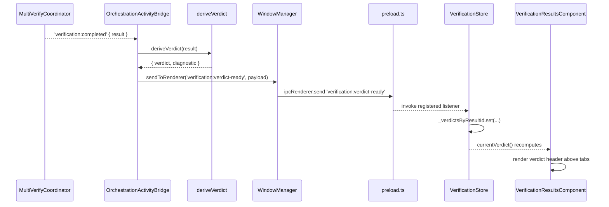
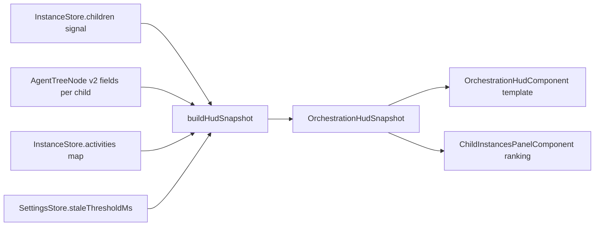
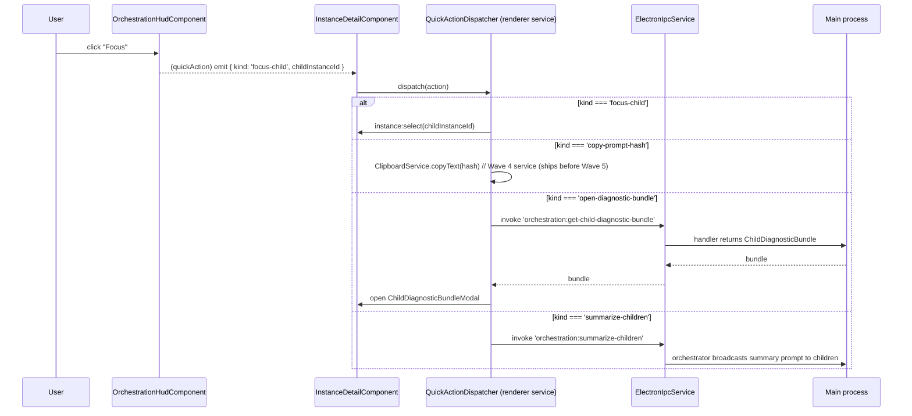

# Wave 5: Orchestration HUD & Verification Verdicts — Design

**Date:** 2026-04-28
**Status:** Completed
**Parent design:** [`docs/superpowers/specs/2026-04-28-cross-repo-usability-upgrades-design.md`](./2026-04-28-cross-repo-usability-upgrades-design.md) (Track C — Orchestration And Verification Visibility)
**Parent plan:** [`docs/superpowers/plans/2026-04-28-cross-repo-usability-upgrades-plan.md`](../plans/2026-04-28-cross-repo-usability-upgrades-plan.md) (Wave 5)
**Implementation plan (to follow):** `docs/superpowers/plans/2026-04-28-wave5-orchestration-hud-verification-verdicts-plan.md`

## Doc taxonomy in this repo

This spec is one of several artifacts in a multi-wave program. To prevent confusion and doc sprawl:

| Artifact | Folder | Filename pattern | Purpose |
|---|---|---|---|
| **Design / spec** | `docs/superpowers/specs/` | `YYYY-MM-DD-<topic>-design.md` | What we're building, why, how it fits, types & contracts |
| **Plan** | `docs/superpowers/plans/` | `YYYY-MM-DD-<topic>.md` (or `…-plan.md`) | Wave/task breakdown, files to read, exit criteria |
| **Master / roadmap plan** | `docs/superpowers/plans/` | `YYYY-MM-DD-<name>-master-plan.md` | Multi-feature umbrella spanning many specs/plans |
| **Completed**  | either folder | `…_completed.md` suffix | Archived after the work shipped |

This document is a **per-wave child design** of the parent program design. The relationship is:

```
parent design (cross-repo-usability-upgrades-design.md)
  ├── Track A → wave 1 spec (DONE)
  ├── Track A → wave 2 spec (TBD)
  ├── Track B → wave 3 spec (TBD)
  ├── Track C → this wave 5 spec (CHILD)
  └── Track D → waves 4 & 6 specs (TBD)

parent plan (cross-repo-usability-upgrades-plan.md)
  └── Wave 5 task list  ←── implemented by this child spec
```

The parent design and plan remain authoritative for cross-track coupling, deferred ideas, and risks; this child design is authoritative for **everything required to implement Wave 5 end to end**.

---

## Goal

Make multi-agent runs and verification results legible at a glance without log diving. Wave 5 ships:

1. **Derived child state** (stale, active, waiting, failed, turn count, churn count) computed on-read in the renderer from the existing `AgentTreeNode` v2 fields — no schema migration.
2. **Role badges + heartbeat / last-activity** rendered inline in the existing child instances panel.
3. **Compact orchestration HUD** for parent sessions: child counts by category and "needs attention" items rolled up above the child panel.
4. **Quick actions** wired through existing IPC: focus child (`instance:select`), copy spawn-prompt hash (clipboard), open child diagnostic bundle (modal), and broadcast a "summarize children" prompt.
5. **`VerificationVerdict` shared type + Zod schema** with status (`pass | pass-with-notes | needs-changes | blocked | inconclusive`), confidence, required actions, risk areas, evidence, and preserved raw responses.
6. **Verdict header** rendered above the existing detailed consensus display in `verification-results.component.html` — keeping the existing tabs (Summary/Comparison/Debate/Raw) intact.

The wave normalizes presentation without inventing a parallel persistence layer: existing `AgentTreeSnapshot`, `ChildDiagnosticBundle`, `VerificationResult`, and orchestration activity events remain the source of truth.

## Decisions locked from brainstorming

| # | Decision | Rationale |
|---|---|---|
| 1 | **Derived child state = computed-on-read in renderer**, not persisted in agent tree v2. New optional fields can be added to `AgentTreeNode` as a v3 schema migration only if persistence is needed; Wave 5 derives from existing fields to avoid migration cost. | Existing fields (`heartbeatAt`, `lastActivityAt`, `statusTimeline`, `status`, `role`) are sufficient. Migrating the schema for ergonomics is a heavy lift for a UI-only readout. |
| 2 | **Stale threshold = 30s default**, configurable via setting `orchestration.staleThresholdMs`. | Matches the typical CLI keepalive window. Setting allows tuning per-environment without recompiling. |
| 3 | **Churn = count of distinct status changes in last 60s** (rolling window over `statusTimeline`); threshold for "churning" = ≥5 changes in 60s. | Captures flapping recovery loops without false-positiving on normal idle→busy→idle cycles. |
| 4 | **Turn count = `statusTimeline.length`** — cheap, recompute on render is fine. | The list is bounded (timeline trims on persistence); no separate counter needed. |
| 5 | **Categorization is mutually-exclusive in priority order:** `failed` > `waiting` > `active` > `stale` > `idle`. `failed` always wins; `stale` only applies to `idle`. | Avoids a child showing as both "active" and "stale" — the operator wants one banner, not three. |
| 6 | **`VerificationVerdict` is a NEW shared type, not an extension of `VerificationResult`.** It references `rawResponses: AgentResponse[]` for transparency. The verdict is derived (synchronously) from `VerificationResult.analysis` + `synthesisConfidence`. | Verdict is a *presentation contract*. Mixing it into `VerificationResult` would force migrations for every existing consumer of `VerificationResult`. |
| 7 | **Verdict status enum:** `'pass' \| 'pass-with-notes' \| 'needs-changes' \| 'blocked' \| 'inconclusive'`. | Mirrors the parent design's Track C wording. `inconclusive` is the explicit fallback when confidence is below threshold or analysis is malformed. |
| 8 | **Confidence = `synthesisConfidence`** (0–1) carried through; do not re-derive. | Confidence is already calibrated by the synthesis strategy; re-deriving would diverge from the existing dashboard reading. |
| 9 | **`requiredActions` / `riskAreas` extracted from `analysis.disagreements`/`analysis.outlierAgents`** via simple heuristic; if extraction fails, default to empty arrays. | Heuristic is small and tested. Empty arrays are a safe degraded state — verdict still emits with status `'inconclusive'` if confidence < 0.4. |
| 10 | **HUD lives in the parent session detail view** as a collapsible section above the existing child panel; uses computed signals derived from `InstanceStore.children()` + the new agent-tree-v2 surfacing. | Reuses existing layout slot in `instance-detail.component.html` (right column, just above `<app-child-instances-panel>`). |
| 11 | **Quick actions wire via existing IPC where possible:** focus child = `instance:select`; copy prompt hash = `inject(CLIPBOARD_SERVICE).copyText(...)` from Wave 4 (where `CLIPBOARD_SERVICE` is `InjectionToken<ClipboardService>`; parent design ship order pins Wave 4 before Wave 5; if Wave 4 has not landed when Wave 5 begins, escalate); open diagnostic bundle = new `child-diagnostic-bundle.modal.component.ts` consuming the existing `child-diagnostics.ts` bundle; summarize children = orchestrator broadcast prompt. | Avoids inventing new orchestration channels and keeps a single clipboard surface. |
| 12 | **No agent-tree migration in Wave 5.** All derived state computed on the fly. If perf becomes an issue at >50 children, follow-up wave promotes to persisted fields. | We keep `AGENT_TREE_SCHEMA_VERSION = 2`. Derivers are pure and memoizable. |
| 13 | **Schema location chosen via investigation, not assumption:** `packages/contracts/src/schemas/verification.schemas.ts` does **not** currently exist (verified by `ls packages/contracts/src/schemas/`). The Wave 5 verdict schema is added at a **new `@contracts/schemas/verification` subpath**, requiring the **4-place alias-sync** per AGENTS.md gotcha #1 (`tsconfig.json`, `tsconfig.electron.json`, `src/main/register-aliases.ts`, `vitest.config.ts`). The new file co-locates with peers (`session.schemas.ts`, `orchestration.schemas.ts`). | Verified via `ls /Users/suas/work/orchestrat0r/ai-orchestrator/packages/contracts/src/schemas/` and `grep -n "verification" /Users/suas/work/orchestrat0r/ai-orchestrator/src/main/register-aliases.ts`. The contracts package is the right home; co-locating with `cross-model-review-schemas.ts` in `src/shared/validation/` would split the verification surface across two trees. |

## Validation method

The decisions and types in this spec were grounded by reading these files in full prior to drafting:

- Parent docs: `docs/superpowers/specs/2026-04-28-cross-repo-usability-upgrades-design.md` (Track C, lines 208–247), `docs/superpowers/plans/2026-04-28-cross-repo-usability-upgrades-plan.md` (Wave 5, lines 196–237).
- Wave 1 reference (mirrored structure): `docs/superpowers/specs/2026-04-28-wave1-command-registry-and-overlay-design.md`, `docs/superpowers/plans/2026-04-28-wave1-command-registry-and-overlay-plan.md`.
- Shared types: `src/shared/types/agent-tree.types.ts` (lines 8–46 for `AgentTreeNode`, lines 69–95 for `ChildDiagnosticBundle`), `src/shared/types/verification.types.ts` (lines 86–99 for `VerificationAnalysis`, 142–165 for `VerificationResult`).
- Main: `src/main/orchestration/child-diagnostics.ts` (full), `src/main/orchestration/orchestration-activity-bridge.ts` (full — lines 232–305 for verification wiring), `src/main/register-aliases.ts` (lines 22–38 for the existing alias map; no `verification` entry today).
- Renderer: `src/renderer/app/features/instance-detail/child-instances-panel.component.ts` (lines 1–330 — existing `ChildInfo` shape, derived counts, status rank), `src/renderer/app/features/instance-detail/instance-detail.component.html` (lines 220–235 — child panel mount slot), `src/renderer/app/features/verification/results/verification-results.component.ts` (lines 1–120 — existing tabs/results shape), `src/renderer/app/features/verification/results/verification-results.component.html` (lines 1–80 — header + tabs), `src/renderer/app/core/state/verification/verification.store.ts` (lines 1–80 — store re-exports), `src/renderer/app/core/state/verification/verification.types.ts` (lines 1–112).
- Schema package layout: `packages/contracts/src/schemas/*.schemas.ts` (directory listing — no existing `verification.schemas.ts`); `src/main/register-aliases.ts` exact-aliases map.
- Wave 4 dependency probe: `src/renderer/app/core/services/*.ts` (no `clipboard.service.ts` yet — confirmed absent → fallback path required).

---

## 1. Type model

All shared types live in `src/shared/types/verification.types.ts` (existing file extended) and a new `src/shared/types/orchestration-hud.types.ts` plus `src/shared/utils/child-state-deriver.ts`. Existing fields are unchanged.

### 1.1 `VerificationVerdict` and `VerdictStatus`

Append to `src/shared/types/verification.types.ts`:

```ts
/**
 * Closed enum for the canonical verdict status. Mutually exclusive.
 */
export type VerdictStatus =
  | 'pass'             // High confidence, no required actions, no outliers.
  | 'pass-with-notes'  // High confidence, but riskAreas non-empty.
  | 'needs-changes'    // Medium confidence, requiredActions non-empty.
  | 'blocked'          // ≥1 outlier and confidence below 0.5, or explicit human-review flag.
  | 'inconclusive';    // confidence < 0.4 OR analysis missing/malformed.

export const VERDICT_STATUSES: readonly VerdictStatus[] = [
  'pass', 'pass-with-notes', 'needs-changes', 'blocked', 'inconclusive',
] as const;

/**
 * Severity classification for a single risk area surfaced in the verdict.
 */
export type RiskAreaSeverity = 'low' | 'medium' | 'high';

/**
 * Closed enum for risk-area categories. Extending this requires a contract update.
 */
export type RiskAreaCategory =
  | 'correctness'
  | 'security'
  | 'performance'
  | 'compatibility'
  | 'data-loss'
  | 'ux'
  | 'maintainability'
  | 'unknown';

export interface RiskArea {
  category: RiskAreaCategory;
  description: string;
  severity: RiskAreaSeverity;
  /** Free-form references back to evidence; e.g. agent IDs whose response surfaced this risk. */
  agentIds?: string[];
}

/**
 * A pointer back into the raw evidence trail. Keeps the verdict auditable.
 */
export interface VerdictEvidence {
  kind: 'agent-response' | 'agreement' | 'disagreement' | 'outlier' | 'unique-insight';
  /** Agent or response identifier — `AgentResponse.agentId` or `UniqueInsight.agentId`. */
  agentId?: string;
  /** Free-form snippet for inline rendering; bounded to 280 chars at construction time. */
  snippet?: string;
  /** Optional structured key-point reference. */
  keyPointId?: string;
}

/**
 * Canonical, presentation-oriented verdict. Derived (synchronously) from a
 * VerificationResult via deriveVerdict(). NOT a replacement for VerificationResult.
 */
export interface VerificationVerdict {
  /** Canonical status. */
  status: VerdictStatus;

  /** 0–1, copied from VerificationResult.synthesisConfidence (NOT re-derived). */
  confidence: number;

  /** Optional one-sentence headline rendered next to the status chip. */
  headline?: string;

  /** Concrete actions the operator should take. Drawn from disagreements + outliers. */
  requiredActions: string[];

  /** Areas of concern with category + severity. Drawn from disagreements/outliers/unique-insights. */
  riskAreas: RiskArea[];

  /** Pointer-style references back into the raw analysis. */
  evidence: VerdictEvidence[];

  /** Preserved verbatim from VerificationResult.responses. Verdict never truncates this. */
  rawResponses: AgentResponse[];

  /** ID of the source VerificationResult, for traceability. */
  sourceResultId: string;

  /** ms epoch when verdict was derived. */
  derivedAt: number;

  /** Schema version for future migration. */
  schemaVersion: 1;
}

export const VERIFICATION_VERDICT_SCHEMA_VERSION = 1;
```

### 1.2 `ChildDerivedState`

New file: `src/shared/utils/child-state-deriver.ts`. Pure functions only. Consumed by the HUD builder and the child panel renderer.

```ts
import type { AgentTreeNode } from '../types/agent-tree.types';

/**
 * Categorization is mutually exclusive and computed in priority order:
 *   failed > waiting > active > stale > idle
 *
 * - failed:  status is in FAILED_STATUSES (e.g. 'error', 'crashed').
 * - waiting: status === 'waiting_for_input'.
 * - active:  status is in ACTIVE_STATUSES (busy, initializing, respawning, ...).
 * - stale:   category would be 'idle' BUT (now - lastActivityAt) > staleThresholdMs.
 * - idle:    everything else (idle, terminated, completed).
 */
export type ChildStateCategory = 'failed' | 'waiting' | 'active' | 'stale' | 'idle';

export interface ChildDerivedState {
  /** Final mutually-exclusive bucket. */
  category: ChildStateCategory;
  /** True iff category === 'failed'. */
  isFailed: boolean;
  /** True iff category === 'waiting'. */
  isWaiting: boolean;
  /** True iff category === 'active'. */
  isActive: boolean;
  /** True iff category === 'stale'. */
  isStale: boolean;
  /** Number of distinct status entries in statusTimeline. */
  turnCount: number;
  /** Number of status changes within the last `churnWindowMs` (default 60s). */
  churnCount: number;
  /** True iff churnCount >= churnThreshold (default 5). */
  isChurning: boolean;
  /** ms epoch of last activity (echoed from node.lastActivityAt for callers' convenience). */
  lastActivityAt: number;
  /** Optional ms epoch of last heartbeat. */
  heartbeatAt?: number;
  /** ms since last activity at the time of derivation. */
  ageMs: number;
}

export interface ChildStateDeriverOptions {
  /** Default 30000 (30s). Configurable via the orchestration.staleThresholdMs setting. */
  staleThresholdMs?: number;
  /** Default 60000 (60s). Rolling window for churn calc. */
  churnWindowMs?: number;
  /** Default 5. Minimum status changes in window to flag churn. */
  churnThreshold?: number;
  /** Defaults to Date.now(). Injectable for tests. */
  now?: number;
}
```

### 1.3 `OrchestrationHudSnapshot`

New file: `src/shared/types/orchestration-hud.types.ts`.

```ts
import type { ChildStateCategory, ChildDerivedState } from '../utils/child-state-deriver';

/**
 * Single child entry shaped for HUD rendering. Pure data; no DOM or signal.
 */
export interface HudChildEntry {
  instanceId: string;
  displayName: string;
  /** Echoed for convenience; same reference as AgentTreeNode.role. */
  role?: string;
  /** Echoed for convenience; same reference as AgentTreeNode.spawnPromptHash. */
  spawnPromptHash?: string;
  derived: ChildDerivedState;
  /** Optional last activity description (e.g. activity bridge string). */
  activity?: string;
}

/**
 * Aggregated HUD payload for one parent session.
 */
export interface OrchestrationHudSnapshot {
  parentInstanceId: string;
  /** Total children regardless of category. */
  totalChildren: number;
  /** Counts keyed by ChildStateCategory; covers all five buckets. */
  countsByCategory: Record<ChildStateCategory, number>;
  /** Children flagged churning (subset of countsByCategory.active|stale|...). */
  churningCount: number;
  /** Sorted list — failed first, then waiting, then active, then stale, then idle. */
  children: HudChildEntry[];
  /** "Attention items" = subset of children with category in {failed, waiting} OR isChurning. */
  attentionItems: HudChildEntry[];
  /** ms epoch when this snapshot was computed. */
  generatedAt: number;
}
```

### 1.4 Quick action contracts

Quick actions are dispatched from the HUD and the child panel. They are typed as a discriminated union to keep the click → IPC mapping legible:

```ts
export type HudQuickAction =
  | { kind: 'focus-child'; childInstanceId: string }
  | { kind: 'copy-prompt-hash'; childInstanceId: string; spawnPromptHash: string }
  | { kind: 'open-diagnostic-bundle'; childInstanceId: string }
  | { kind: 'summarize-children'; parentInstanceId: string };

export interface HudQuickActionResult {
  ok: boolean;
  /** Optional human-readable reason for failure (e.g. 'No prompt hash on this child'). */
  reason?: string;
}
```

### 1.5 IPC payload types (verdict event)

New event from main → renderer via `windowManager.sendToRenderer('verification:verdict-ready', payload)`:

```ts
export interface VerificationVerdictReadyPayload {
  /** Same id as VerificationResult.id. */
  resultId: string;
  /** Instance that requested the verification. */
  instanceId: string;
  /** The full verdict, including rawResponses (preserved). */
  verdict: VerificationVerdict;
}
```

### 1.6 Diagnostic shape (graceful-degradation tracking)

When `deriveVerdict()` falls back (low confidence, missing analysis, etc.), it records a small diagnostic so the renderer can show a "verdict was synthesized but evidence was sparse" hint:

```ts
export interface VerdictDerivationDiagnostic {
  /** Why deriveVerdict produced its result. */
  reason:
    | 'normal'
    | 'low-confidence'
    | 'missing-analysis'
    | 'no-disagreements'
    | 'unknown-error';
  /** Free-form note for logging. */
  note?: string;
}
```

The diagnostic is NOT part of the public `VerificationVerdict`; it travels alongside it on the IPC event payload only when `reason !== 'normal'`. The renderer logs and optionally renders a small "?" badge.

---

## 2. Pure function signatures

### 2.1 `deriveVerdict`

New file: `src/main/orchestration/verification-verdict-deriver.ts`. Pure synchronous. Used by `MultiVerifyCoordinator` (or a thin wrapper at IPC emit time) to produce the verdict.

```ts
import type {
  VerificationResult,
  VerificationVerdict,
  VerdictDerivationDiagnostic,
} from '../../shared/types/verification.types';

export interface DeriveVerdictOptions {
  /** Confidence below this threshold forces status = 'inconclusive'. Default 0.4. */
  inconclusiveBelow?: number;
  /** Confidence below this and outliers present forces 'blocked'. Default 0.5. */
  blockedBelow?: number;
  /** Confidence at or above this with empty riskAreas forces 'pass'. Default 0.85. */
  passAtOrAbove?: number;
  /** Defaults to Date.now(). Injectable for tests. */
  now?: number;
}

export interface DeriveVerdictResult {
  verdict: VerificationVerdict;
  diagnostic: VerdictDerivationDiagnostic;
}

export function deriveVerdict(
  result: VerificationResult,
  options?: DeriveVerdictOptions,
): DeriveVerdictResult;
```

#### Algorithm (specification)

Inputs: `VerificationResult` with `analysis`, `synthesisConfidence`, `responses`.

1. **Normalize confidence**: clamp `synthesisConfidence` to `[0, 1]`. If non-finite, treat as `0` and mark `reason = 'missing-analysis'`.
2. **Build evidence**:
   - For each `agreement` of strength ≥ 0.66 → push `{ kind: 'agreement', agentId: undefined, snippet: agreement.point.slice(0, 280) }`.
   - For each `disagreement` → push `{ kind: 'disagreement', snippet: disagreement.topic.slice(0, 280) }`.
   - For each `outlierAgentId` in `analysis.outlierAgents` → push `{ kind: 'outlier', agentId }`.
   - For each `uniqueInsight` with `value === 'high'` → push `{ kind: 'unique-insight', agentId, snippet: insight.point.slice(0, 280), keyPointId: insight.point /* hashed in implementation */ }`.
3. **Extract `requiredActions`** (heuristic):
   - For each `disagreement` with `requiresHumanReview === true` → `"Resolve: ${topic}"`.
   - For each `outlierAgent` → `"Audit response from ${agentId}"`.
   - Deduplicate by exact string match. Cap at 10 entries; suffix with `"…and N more"` if truncated.
4. **Extract `riskAreas`** (heuristic):
   - For each `disagreement` with positions of length ≥ 3 → `{ category: 'correctness', description: topic, severity: 'medium', agentIds: positions.map(p => p.agentId) }`.
   - For each `uniqueInsight` with `value === 'high'` and `category === 'warning'` → `{ category: 'unknown', description: insight.point, severity: 'medium', agentIds: [insight.agentId] }`.
   - If `analysis.outlierAgents.length > 0` AND `consensusStrength < 0.5` → push `{ category: 'correctness', description: 'Significant outlier disagreement', severity: 'high', agentIds: analysis.outlierAgents }`.
   - Cap at 8 entries.
5. **Choose status** (priority order, first match wins):
   - `confidence < inconclusiveBelow (0.4)` → `'inconclusive'`, `reason = 'low-confidence'`.
   - `outlierAgents.length > 0 && confidence < blockedBelow (0.5)` → `'blocked'`.
   - `requiredActions.length > 0` → `'needs-changes'`.
   - `riskAreas.length > 0 && confidence >= passAtOrAbove (0.85)` → `'pass-with-notes'`.
   - `riskAreas.length === 0 && requiredActions.length === 0 && confidence >= passAtOrAbove` → `'pass'`.
   - Otherwise → `'needs-changes'`.
6. **Build verdict**: assemble `VerificationVerdict` with `rawResponses = result.responses` (NEVER truncated), `sourceResultId = result.id`, `derivedAt = options.now ?? Date.now()`, `schemaVersion = 1`.
7. **Headline**: short canned string per status (e.g. `'Looks good — no actions required.'`, `'Needs changes — see required actions.'`). Implementation lives in the same module behind a `headlineForStatus(status: VerdictStatus): string`.

The function is **side-effect-free**. No logger calls inside the deriver itself; the calling site logs the diagnostic if `reason !== 'normal'`.

### 2.2 `deriveChildState`

In `src/shared/utils/child-state-deriver.ts`:

```ts
import type { AgentTreeNode } from '../types/agent-tree.types';
import type { ChildDerivedState, ChildStateDeriverOptions } from './child-state-deriver';

export const FAILED_STATUSES: ReadonlySet<string> = new Set([
  'error', 'crashed', 'failed',
]);

export const ACTIVE_STATUSES: ReadonlySet<string> = new Set([
  'busy', 'initializing', 'respawning', 'interrupting',
  'cancelling', 'interrupt-escalating',
]);

export function deriveChildState(
  node: Pick<AgentTreeNode, 'status' | 'statusTimeline' | 'lastActivityAt' | 'heartbeatAt'>,
  options?: ChildStateDeriverOptions,
): ChildDerivedState;
```

Algorithm:

1. `now = options.now ?? Date.now()`.
2. `staleThresholdMs = options.staleThresholdMs ?? 30_000`.
3. `churnWindowMs = options.churnWindowMs ?? 60_000`.
4. `churnThreshold = options.churnThreshold ?? 5`.
5. `ageMs = Math.max(0, now - node.lastActivityAt)`.
6. `turnCount = node.statusTimeline.length`.
7. `churnCount = node.statusTimeline.filter(e => (now - e.timestamp) <= churnWindowMs).length`.
8. `isChurning = churnCount >= churnThreshold`.
9. **Bucket** (mutually exclusive, priority order):
   - `FAILED_STATUSES.has(node.status)` → `'failed'`.
   - else `node.status === 'waiting_for_input'` → `'waiting'`.
   - else `ACTIVE_STATUSES.has(node.status)` → `'active'`.
   - else (idle/terminated) AND `ageMs > staleThresholdMs` → `'stale'`.
   - else → `'idle'`.
10. Set `isFailed/isWaiting/isActive/isStale` flags from the chosen category. Return.

### 2.3 `buildHudSnapshot`

New file: `src/main/orchestration/orchestration-hud-builder.ts` (also re-exported from a renderer-facing helper module so the renderer can rebuild the snapshot from its own signals without IPC). The implementation is shared and pure:

```ts
import type { AgentTreeNode } from '../../shared/types/agent-tree.types';
import type {
  HudChildEntry,
  OrchestrationHudSnapshot,
} from '../../shared/types/orchestration-hud.types';
import type { ChildStateDeriverOptions } from '../../shared/utils/child-state-deriver';

export interface BuildHudSnapshotInput {
  parentInstanceId: string;
  /** Children of the parent in their AgentTreeNode form. */
  children: AgentTreeNode[];
  /** Optional activity bridge map (instanceId → most recent activity string). */
  activities?: ReadonlyMap<string, string>;
  /** Forwarded to deriveChildState. */
  derivationOptions?: ChildStateDeriverOptions;
}

export function buildHudSnapshot(input: BuildHudSnapshotInput): OrchestrationHudSnapshot;
```

Algorithm:

1. Initialize `countsByCategory = { failed: 0, waiting: 0, active: 0, stale: 0, idle: 0 }`.
2. Map each child node → `HudChildEntry` via `deriveChildState`.
3. Increment `countsByCategory[entry.derived.category]` per entry.
4. `churningCount = entries.filter(e => e.derived.isChurning).length`.
5. Sort entries: `failed` first, then `waiting`, then `active`, then `stale`, then `idle`. Within each bucket, churn-positives bubble above churn-negatives, then sort by `lastActivityAt` descending.
6. `attentionItems = entries.filter(e => e.derived.isFailed || e.derived.isWaiting || e.derived.isChurning)`.
7. Return `OrchestrationHudSnapshot`.

The function is pure; the renderer wraps it in a `computed()` that observes `InstanceStore.children()` + agent tree v2 fields and re-runs on signal change. Memoization is optional — for ≤50 children the cost is dominated by `deriveChildState` which is O(timeline.length) per child.

### 2.4 Other helpers (small, in same files)

- `headlineForStatus(status: VerdictStatus): string` — canned phrases.
- `extractRequiredActions(analysis: VerificationAnalysis): string[]` — split out for testability.
- `extractRiskAreas(analysis: VerificationAnalysis): RiskArea[]` — split out for testability.
- `clampConfidence(n: number): number` — Math.min(1, Math.max(0, n)) with NaN guard.

---

## 3. Schema/IPC alignment

### 3.1 Schema location decision (investigated)

`packages/contracts/src/schemas/verification.schemas.ts` does not exist today (verified at draft time via directory listing). Wave 5 creates it as a **new `@contracts/schemas/verification` subpath**, which triggers AGENTS.md packaging gotcha #1: the alias must be registered in **four** places to avoid a packaged-DMG runtime crash.

#### Required alias-sync edits (4 places)

1. `tsconfig.json` → `"@contracts/schemas/verification": ["./packages/contracts/src/schemas/verification.schemas.ts"]`
2. `tsconfig.electron.json` → same path entry
3. `src/main/register-aliases.ts` → `'@contracts/schemas/verification': path.join(baseContracts, 'schemas', 'verification.schemas')`
4. `vitest.config.ts` → mirror the alias if any test file imports from `@contracts/schemas/verification`

#### File contents (sketch)

`packages/contracts/src/schemas/verification.schemas.ts`:

```ts
import { z } from 'zod';

export const VERDICT_STATUS_VALUES = [
  'pass', 'pass-with-notes', 'needs-changes', 'blocked', 'inconclusive',
] as const;

export const VerdictStatusSchema = z.enum(VERDICT_STATUS_VALUES);

export const RiskAreaCategorySchema = z.enum([
  'correctness', 'security', 'performance', 'compatibility',
  'data-loss', 'ux', 'maintainability', 'unknown',
]);

export const RiskAreaSeveritySchema = z.enum(['low', 'medium', 'high']);

export const RiskAreaSchema = z.object({
  category: RiskAreaCategorySchema,
  description: z.string().min(1).max(2_000),
  severity: RiskAreaSeveritySchema,
  agentIds: z.array(z.string()).optional(),
});

export const VerdictEvidenceSchema = z.object({
  kind: z.enum(['agent-response', 'agreement', 'disagreement', 'outlier', 'unique-insight']),
  agentId: z.string().optional(),
  snippet: z.string().max(280).optional(),
  keyPointId: z.string().optional(),
});

// AgentResponseSchema is referenced by full path to keep this file independent;
// where it lives is decided in the plan (usually re-exported from this file
// after migrating from the renderer-side validation/cross-model-review-schemas.ts
// or co-located here as a brand-new schema mirroring src/shared/types/verification.types.ts).
export const AgentResponseSchema = z.object({
  agentId: z.string(),
  agentIndex: z.number().int().nonnegative(),
  model: z.string(),
  personality: z.string().optional(),
  response: z.string(),
  keyPoints: z.array(z.unknown()), // reuse ExtractedKeyPointSchema once migrated
  confidence: z.number().min(0).max(1),
  reasoning: z.string().optional(),
  duration: z.number().nonnegative(),
  tokens: z.number().nonnegative(),
  cost: z.number().nonnegative(),
  error: z.string().optional(),
  timedOut: z.boolean().optional(),
});

export const VerificationVerdictSchema = z.object({
  status: VerdictStatusSchema,
  confidence: z.number().min(0).max(1),
  headline: z.string().max(500).optional(),
  requiredActions: z.array(z.string().max(1_000)),
  riskAreas: z.array(RiskAreaSchema),
  evidence: z.array(VerdictEvidenceSchema),
  rawResponses: z.array(AgentResponseSchema),
  sourceResultId: z.string(),
  derivedAt: z.number().int().nonnegative(),
  schemaVersion: z.literal(1),
});

export const VerdictDerivationDiagnosticSchema = z.object({
  reason: z.enum(['normal', 'low-confidence', 'missing-analysis', 'no-disagreements', 'unknown-error']),
  note: z.string().max(2_000).optional(),
});

export const VerificationVerdictReadyPayloadSchema = z.object({
  resultId: z.string(),
  instanceId: z.string(),
  verdict: VerificationVerdictSchema,
  diagnostic: VerdictDerivationDiagnosticSchema.optional(),
});

export type VerificationVerdictPayload = z.infer<typeof VerificationVerdictSchema>;
export type VerificationVerdictReadyPayloadParsed = z.infer<typeof VerificationVerdictReadyPayloadSchema>;
```

#### Alternative considered and rejected

Co-locating the schema in `src/shared/validation/verification-schemas.ts` (no new subpath, no alias-sync). Rejected because the verification surface should live with peer schemas (`session.schemas.ts`, `orchestration.schemas.ts`); splitting verification across two trees is the same anti-pattern Wave 1 avoided for command schemas.

### 3.2 IPC event

`OrchestrationActivityBridge` is extended (or a new sibling helper is added — see plan) to emit `verification:verdict-ready` after a successful verification, calling `deriveVerdict` on the completed `VerificationResult` and forwarding `VerificationVerdictReadyPayload` via `windowManager.sendToRenderer(...)`. The renderer subscribes through `preload.ts` and routes the payload into the verification store as a computed verdict signal.

---

## 4. Renderer integration

### 4.1 `verification.store.ts` additions

```ts
// new private signal
private _verdictsByResultId = signal<Map<string, VerificationVerdict>>(new Map());
verdictsByResultId = this._verdictsByResultId.asReadonly();

// computed verdict for the current result
readonly currentVerdict = computed<VerificationVerdict | null>(() => {
  const r = this.result();
  if (!r) return null;
  return this._verdictsByResultId().get(r.id) ?? null;
});

// new IPC subscription (set up in constructor / ngOnInit)
private subscribeToVerdictEvents(): void {
  this.unsubscribes.push(
    this.ipc.on<VerificationVerdictReadyPayload>('verification:verdict-ready', (payload) => {
      const next = new Map(this._verdictsByResultId());
      next.set(payload.resultId, payload.verdict);
      this._verdictsByResultId.set(next);
    })
  );
}
```

### 4.2 Verification results component

`verification-results.component.html` — render a verdict header above the existing `<div class="results-header">`:

```html
@if (verdict(); as v) {
  <div
    class="verdict-header"
    [attr.data-status]="v.status"
    role="region"
    aria-label="Verification verdict"
  >
    <div class="verdict-status-row">
      <span class="verdict-chip verdict-chip--{{ v.status }}">
        {{ verdictStatusLabel(v.status) }}
      </span>
      <span class="verdict-confidence">
        {{ formatConfidence(v.confidence) }}
      </span>
      @if (v.headline) {
        <span class="verdict-headline">{{ v.headline }}</span>
      }
    </div>

    @if (v.requiredActions.length > 0) {
      <div class="verdict-actions">
        <h3>Required actions</h3>
        <ul>
          @for (a of v.requiredActions; track a) {
            <li>{{ a }}</li>
          }
        </ul>
      </div>
    }

    @if (v.riskAreas.length > 0) {
      <div class="verdict-risk-areas">
        <h3>Risk areas</h3>
        <ul>
          @for (r of v.riskAreas; track r.description) {
            <li>
              <span class="risk-category">{{ r.category }}</span>
              <span class="risk-severity risk-severity--{{ r.severity }}">{{ r.severity }}</span>
              <span class="risk-description">{{ r.description }}</span>
            </li>
          }
        </ul>
      </div>
    }
  </div>
}
```

`verification-results.component.ts` — add:

```ts
verdict = computed(() => this.store.currentVerdict());

verdictStatusLabel(status: VerdictStatus): string {
  switch (status) {
    case 'pass':             return 'Pass';
    case 'pass-with-notes':  return 'Pass with notes';
    case 'needs-changes':    return 'Needs changes';
    case 'blocked':          return 'Blocked';
    case 'inconclusive':     return 'Inconclusive';
  }
}

formatConfidence(c: number): string {
  return `${Math.round(c * 100)}% confidence`;
}
```

The existing tabs (Summary/Comparison/Debate/Raw) remain unchanged below the verdict header. Raw responses tab continues to render `result.responses` — the verdict's `rawResponses` is the same array, so no duplication.

### 4.3 Child instances panel — role badge, heartbeat, derived state, churn

`child-instances-panel.component.ts` — extend `ChildInfo` to include `role`, `heartbeatAt`, `derived: ChildDerivedState`, and rename `runningChildCount` → kept (already there) but supplement with `staleChildCount`, `failedChildCount`, `churningChildCount`. The existing `getStatusRank()` is replaced by `derived.category`-based ranking using the same priority as `buildHudSnapshot`.

The component reads `AgentTreeNode` data via the existing `InstanceStore.getInstance()` plus a thin new accessor on the store (`InstanceStore.getAgentTreeNode(id): AgentTreeNode | undefined`) backed by the existing tree IPC. If that accessor doesn't already exist on `InstanceStore`, the plan adds it (small, fed by the agent-tree snapshot the store already maintains).

HTML deltas (illustrative):

```html
<button class="child-item" [class.active]="info.derived.isActive" ...>
  <app-status-indicator [status]="info.status" />
  @if (info.role) {
    <span class="role-badge">{{ info.role }}</span>
  }
  <span class="child-name">{{ info.displayName }}</span>
  <span class="child-status">{{ info.statusLabel }}</span>
  @if (info.derived.isChurning) {
    <span class="churn-badge" title="≥5 status changes in last 60s">churn ×{{ info.derived.churnCount }}</span>
  }
  @if (info.derived.isStale) {
    <span class="stale-badge" title="No activity for >30s">stale</span>
  }
  <span class="heartbeat" [title]="'Last heartbeat: ' + formatHeartbeat(info.derived.heartbeatAt)">
    {{ formatRelativeAge(info.derived.ageMs) }}
  </span>
  @if (info.activity) { <span class="child-activity">{{ info.activity }}</span> }
</button>
```

### 4.4 Orchestration HUD component

New: `src/renderer/app/features/orchestration/orchestration-hud.component.ts` (+ `.html`, `+ .scss`, + spec). Standalone, `OnPush`, signal-driven.

Inputs:
- `parentInstanceId: InputSignal<string>` — required.
- `staleThresholdMs?: InputSignal<number>` — optional override, default flows from settings.

Outputs:
- `quickAction: OutputEmitterRef<HudQuickAction>` — host component dispatches.

Internals:
- Injects `InstanceStore`, `SettingsStore`.
- `snapshot = computed<OrchestrationHudSnapshot>(() => buildHudSnapshot({ parentInstanceId, children, activities, derivationOptions }))`.
- `attentionItems = computed(() => this.snapshot().attentionItems)`.
- `isExpanded = signal(true)` — collapsible.

Template:
```html
<section class="orchestration-hud" [class.collapsed]="!isExpanded()">
  <header class="hud-header" (click)="toggleExpand()">
    <span class="hud-icon">{{ isExpanded() ? '▾' : '▸' }}</span>
    <span class="hud-title">Children ({{ snapshot().totalChildren }})</span>
    <div class="hud-counts">
      @if (counts().failed > 0)  { <span class="count failed">{{ counts().failed }} failed</span> }
      @if (counts().waiting > 0) { <span class="count waiting">{{ counts().waiting }} waiting</span> }
      @if (counts().active > 0)  { <span class="count active">{{ counts().active }} active</span> }
      @if (counts().stale > 0)   { <span class="count stale">{{ counts().stale }} stale</span> }
      @if (counts().idle > 0)    { <span class="count idle">{{ counts().idle }} idle</span> }
      @if (snapshot().churningCount > 0) { <span class="count churn">{{ snapshot().churningCount }} churn</span> }
    </div>
    <button
      class="summarize-btn"
      (click)="emitAction({ kind: 'summarize-children', parentInstanceId: parentInstanceId() }); $event.stopPropagation()"
    >Summarize</button>
  </header>

  @if (isExpanded() && attentionItems().length > 0) {
    <div class="hud-attention">
      <h3>Needs attention</h3>
      @for (item of attentionItems(); track item.instanceId) {
        <article class="hud-row hud-row--{{ item.derived.category }}">
          @if (item.role) { <span class="role-badge">{{ item.role }}</span> }
          <span class="child-name">{{ item.displayName }}</span>
          <span class="category">{{ item.derived.category }}</span>
          @if (item.derived.isChurning) { <span class="churn">churn ×{{ item.derived.churnCount }}</span> }
          <div class="actions">
            <button (click)="emitAction({ kind: 'focus-child', childInstanceId: item.instanceId })">Focus</button>
            @if (item.spawnPromptHash) {
              <button
                (click)="emitAction({ kind: 'copy-prompt-hash', childInstanceId: item.instanceId, spawnPromptHash: item.spawnPromptHash })"
                title="Copy spawn prompt hash"
              >Copy hash</button>
            }
            <button (click)="emitAction({ kind: 'open-diagnostic-bundle', childInstanceId: item.instanceId })">
              Diagnostics
            </button>
          </div>
        </article>
      }
    </div>
  }
</section>
```

The HUD lives in `instance-detail.component.html` immediately above `<app-child-instances-panel>`:

```html
<app-orchestration-hud
  [parentInstanceId]="inst.id"
  (quickAction)="onQuickAction($event)"
/>
<app-child-instances-panel
  [childrenIds]="inst.childrenIds"
  (selectChild)="onSelectChild($event)"
/>
```

### 4.5 Child diagnostic bundle modal

New: `src/renderer/app/features/orchestration/child-diagnostic-bundle.modal.component.ts` (+ `.html`, + spec). Standalone modal that fetches the diagnostic bundle on open via existing IPC (the plan confirms which channel; today, `child-diagnostics.ts` is invoked server-side and the bundle is shipped over an existing channel). Renders:

- header: instance name, status, role, prompt hash with copy button
- routing block (provider/model/requested vs actual)
- statusTimeline as a vertical strip
- recentEvents (last 20)
- recentOutputTail
- artifactsSummary
- timeoutReason (if present)

The modal closes on Esc and on backdrop click; uses focus trap. It is dispatched from `OrchestrationHudComponent` and from `ChildInstancesPanelComponent` via the same `HudQuickAction` discriminated union.

---

## 5. UI flows

### 5.1 Verdict header rendering



### 5.2 HUD aggregation



### 5.3 Quick action click → IPC



---

## 6. Wave 4 dependency (clipboard for copy-prompt-hash)

Wave 5's "copy prompt hash" quick action consumes Wave 4's `ClipboardService` (`copyText(text)` returning `Promise<{ ok: true } | { ok: false; reason: string }>`).

**Ship-order assumption:** the parent design's "Recommended ship order" pins Wave 4 before Wave 5. Wave 5 begins only after Wave 4's `ClipboardService` is merged. There is no temporary `navigator.clipboard.writeText` fallback in Wave 5 source — if Wave 4 has not landed when Wave 5 starts, **STOP and escalate**, do not introduce a stop-gap path. This avoids leaving cleanup work behind for Wave 7.

The `HudQuickAction` discriminated union and the dispatcher signature are stable: `dispatch(action)` returns `Promise<HudQuickActionResult>` with `{ ok: boolean; reason?: string }`. Test fakes inject a `ClipboardService` test double with `copyText: vi.fn().mockResolvedValue({ ok: true })`.

---

## 7. Telemetry & logging

- `deriveVerdict` is silent. The caller (bridge or coordinator) logs the diagnostic via `getLogger('VerificationVerdict').info({ resultId, status, reason })` once per derivation.
- `buildHudSnapshot` is silent. The HUD component does not log per-render; it logs once at first mount.
- Quick action failures (clipboard denied, missing prompt hash, IPC error) log at `warn` with the action kind and instance id.
- The HUD does NOT emit telemetry per-tick; it observes signal changes only.

---

## 8. Test plan

### 8.1 New test files

- `src/shared/utils/__tests__/child-state-deriver.spec.ts`
  - bucketing priority (failed > waiting > active > stale > idle)
  - stale threshold default and override
  - churn calculation across the rolling window
  - turn count = timeline.length
  - clamps `ageMs` to non-negative
- `src/main/orchestration/__tests__/verification-verdict-deriver.spec.ts`
  - status selection table (5 paths)
  - confidence clamping (NaN, negatives, >1)
  - rawResponses preserved (deep equality)
  - requiredActions/riskAreas extraction edge cases
  - empty analysis → `'inconclusive'` with `reason: 'missing-analysis'`
  - low confidence (<0.4) forces `'inconclusive'`
  - blocked path (outliers + low-confidence)
  - serialize/deserialize roundtrip via `VerificationVerdictSchema.parse`
- `src/main/orchestration/__tests__/orchestration-hud-builder.spec.ts`
  - ordering (failed first, churn first within bucket)
  - countsByCategory sums to totalChildren
  - empty children → empty snapshot with all counts = 0
  - attentionItems = failed ∪ waiting ∪ churning
- `src/renderer/app/features/orchestration/__tests__/orchestration-hud.component.spec.ts`
  - renders counts in header
  - emits `quickAction` for each action button
  - collapse/expand toggles
- `src/renderer/app/features/orchestration/__tests__/child-diagnostic-bundle.modal.component.spec.ts`
  - opens with bundle data
  - copy-hash button copies the spawn prompt hash
  - close on Esc and backdrop

### 8.2 Tests to update

- `src/main/orchestration/__tests__/child-diagnostics.spec.ts` — assert that the bundle is unchanged by Wave 5 (regression guard).
- `src/renderer/app/features/instance-detail/__tests__/child-instances-panel.component.spec.ts` (if exists; otherwise create one)
  - role badge renders
  - stale badge renders past threshold
  - churn badge renders at threshold
  - heartbeat label formats correctly
- `src/renderer/app/features/verification/results/verification-results.component.spec.ts` — verdict header renders status, confidence, and required-actions list when present; absent when no verdict signal.
- `src/main/orchestration/__tests__/cross-model-review-service.spec.ts` (if affected) — confirm verdict derivation does not regress existing review outputs.

### 8.3 Manual verification (UI)

- Start a multi-child orchestration with at least 4 children. HUD shows correct counts, "needs attention" surfaces failed/waiting/churning entries.
- Pause one child long enough to exceed the stale threshold; HUD reclassifies it from idle → stale within one render frame.
- Click "Focus" on an attention item → renderer routes to that instance.
- Click "Copy hash" → clipboard contains the hex hash; toast/log confirms.
- Click "Diagnostics" → modal opens with the bundle, statusTimeline, recent events.
- Click "Summarize" → orchestrator broadcast prompt visible in transcript.
- Run a multi-verify; verdict header appears above the existing tab navigation with status, confidence, required actions, risk areas. Switching to Raw tab still shows full responses.
- Restart app and re-open a session with persisted verification result — verdict re-derives (or is re-emitted) and renders.

---

## 9. Risks & mitigations

| Risk | Likelihood | Impact | Mitigation |
|---|---|---|---|
| Schema migration drift if we ever decide to persist derived state on `AgentTreeNode` | Low | Med | Decision 1 + 12 explicitly defer. Plan adds a comment in the deriver pointing at the migration path. |
| Churn calc cost on large trees (>50 children) | Low | Low | Snapshot is O(n × timeline.length); timeline is bounded. Memoize per child via signal-derived computed if profiling shows hotspot. |
| Heartbeat race causing flicker on 'stale' boundary | Med | Low | Snapshot consumer wraps the computed in a `signal.effect` with `outputDebounceMs: 200` (or similar), or the renderer simply re-renders at most ~10Hz. Test with `now` injection. |
| Verdict drops `rawResponses` due to truncation bug | Low | High | Test: `verdict.rawResponses` deep-equal `result.responses`. Lint-style assertion in deriver. |
| IPC payload size for verdict (rawResponses can be large) | Med | Med | Verdict event piggybacks on the existing channel; no new size limit. If a single response exceeds the IPC MessagePort cap, the bridge falls back to omitting `rawResponses` and setting `diagnostic.reason = 'unknown-error'` with a note (renderer fetches via existing `verification:result-fetch` channel as a recovery path). |
| Wave 4 not yet shipped when Wave 5 starts | High | Low | Per parent design ship order, Wave 4 ships before Wave 5. If reality diverges, STOP and escalate — do NOT introduce a `navigator.clipboard` stop-gap (that just shifts cleanup to Wave 7). |
| `@contracts/schemas/verification` alias forgotten in one of 4 sites → packaged DMG crashes on startup | Med | High | Plan Phase 5 has a checklist with all 4 sites and a manual DMG smoke step in Phase 13. |
| `disagreement.requiresHumanReview` heuristic over-triggers `needs-changes` | Med | Med | Threshold-based extraction (positions ≥ 3) keeps the action list short; cap at 10 entries with "…and N more". |
| Activity-bridge wiring could double-send verdicts on retry | Low | Low | Bridge keeps a `Set<resultId>` of derived ids; second emit is a no-op (or re-emits with same payload — idempotent on the renderer side). |

---

## 10. File-by-file change inventory

### Created

| Path | Purpose |
|---|---|
| `src/shared/utils/child-state-deriver.ts` | Pure utilities: `deriveChildState`, `FAILED_STATUSES`, `ACTIVE_STATUSES`, `ChildDerivedState`. |
| `src/shared/utils/__tests__/child-state-deriver.spec.ts` | Unit tests for the deriver. |
| `src/shared/types/orchestration-hud.types.ts` | `HudChildEntry`, `OrchestrationHudSnapshot`, `HudQuickAction`, `HudQuickActionResult`. |
| `src/main/orchestration/verification-verdict-deriver.ts` | `deriveVerdict`, `headlineForStatus`, helper extractors. |
| `src/main/orchestration/__tests__/verification-verdict-deriver.spec.ts` | Unit tests for the verdict deriver. |
| `src/main/orchestration/orchestration-hud-builder.ts` | `buildHudSnapshot` (pure, used by both main and renderer). |
| `src/main/orchestration/__tests__/orchestration-hud-builder.spec.ts` | Unit tests. |
| `packages/contracts/src/schemas/verification.schemas.ts` | Zod schemas for verdict + payload. |
| `packages/contracts/src/schemas/__tests__/verification.schemas.spec.ts` | Roundtrip serialize/deserialize tests. |
| `src/renderer/app/features/orchestration/orchestration-hud.component.ts` | HUD component. |
| `src/renderer/app/features/orchestration/orchestration-hud.component.html` | HUD template. |
| `src/renderer/app/features/orchestration/orchestration-hud.component.scss` | HUD styles. |
| `src/renderer/app/features/orchestration/__tests__/orchestration-hud.component.spec.ts` | Component tests. |
| `src/renderer/app/features/orchestration/child-diagnostic-bundle.modal.component.ts` | Diagnostic bundle modal. |
| `src/renderer/app/features/orchestration/child-diagnostic-bundle.modal.component.html` | Modal template. |
| `src/renderer/app/features/orchestration/child-diagnostic-bundle.modal.component.scss` | Modal styles. |
| `src/renderer/app/features/orchestration/__tests__/child-diagnostic-bundle.modal.component.spec.ts` | Modal tests. |
| `src/renderer/app/features/orchestration/quick-action-dispatcher.service.ts` | Renderer-side dispatcher routing `HudQuickAction` to IPC / clipboard / store. |
| `src/renderer/app/features/orchestration/__tests__/quick-action-dispatcher.service.spec.ts` | Dispatcher tests including clipboard fallback. |

### Modified

| Path | Change |
|---|---|
| `src/shared/types/verification.types.ts` | Add `VerdictStatus`, `VerificationVerdict`, `RiskArea*`, `VerdictEvidence`, `VerdictDerivationDiagnostic`, `VerificationVerdictReadyPayload`, `VERDICT_STATUSES`, `VERIFICATION_VERDICT_SCHEMA_VERSION`. |
| `src/main/orchestration/orchestration-activity-bridge.ts` | After `verification:completed`, call `deriveVerdict` and emit `verification:verdict-ready` to renderer. |
| `src/preload/preload.ts` | Expose listener for `verification:verdict-ready`. |
| `src/renderer/app/core/state/verification/verification.store.ts` | Add `_verdictsByResultId`, `currentVerdict`, IPC subscription. |
| `src/renderer/app/features/verification/results/verification-results.component.ts` | Add `verdict` computed + label/format helpers. |
| `src/renderer/app/features/verification/results/verification-results.component.html` | Render verdict header above existing header. |
| `src/renderer/app/features/verification/results/verification-results.component.scss` | Verdict chip / risk-area styles. |
| `src/renderer/app/features/instance-detail/child-instances-panel.component.ts` | Read AgentTreeNode v2 fields, integrate `deriveChildState`, add role/heartbeat/stale/churn rendering. |
| `src/renderer/app/features/instance-detail/instance-detail.component.html` | Mount `<app-orchestration-hud>` above `<app-child-instances-panel>`. |
| `src/renderer/app/features/instance-detail/instance-detail.component.ts` | Wire `quickAction` → dispatcher. |
| `src/renderer/app/core/state/instance.store.ts` | Add `getAgentTreeNode(id)` accessor (if absent) and a settings-derived `staleThresholdMs` computed. |
| `src/renderer/app/core/state/settings.store.ts` | Add `orchestration.staleThresholdMs` to typed settings (+ default 30000). |
| `tsconfig.json` | Add `@contracts/schemas/verification` path alias. |
| `tsconfig.electron.json` | Same. |
| `src/main/register-aliases.ts` | Add `'@contracts/schemas/verification'` entry to `exactAliases`. |
| `vitest.config.ts` | Mirror the alias if any spec imports from `@contracts/schemas/verification`. |

### Removed

None. All Wave 5 additions are additive; existing consumers of `VerificationResult` keep their current code paths.

---

## 11. Acceptance criteria

The wave is shippable when **all** of the following hold:

1. `npx tsc --noEmit` passes.
2. `npx tsc --noEmit -p tsconfig.spec.json` passes.
3. `npm run lint` passes with no new warnings.
4. New unit specs (§ 8.1) pass; existing tests (§ 8.2) still pass.
5. `verification:verdict-ready` round-trips main → renderer, verdict header renders with status/confidence/actions/risk areas, raw responses tab unchanged.
6. Stale child surfaces "stale" badge in child panel and HUD without the operator reading logs.
7. Churning child surfaces "churn ×N" badge in both panel and HUD.
8. Quick actions: focus, copy hash (fallback path), open diagnostic bundle, summarize children all dispatch correctly.
9. Packaged DMG starts (smoke run) — confirms the `@contracts/schemas/verification` 4-place alias-sync is correct.
10. `VerificationResult.responses` deep-equals `verdict.rawResponses` (no truncation).

---

## 12. Non-goals

- No new agent-tree schema migration (decision 12). All v2 fields used as-is.
- No new orchestration backend or persistence layer. Use existing `child-result-storage`, `child-diagnostics`, `agent-tree-persistence`.
- No replacement of the existing verification tabs (Summary/Comparison/Debate/Raw). Verdict is added above, never below or in place of.
- No rewrite of `MultiVerifyCoordinator`. Only its emit-time hook receives an additional verdict-derive call.
- No new toast/notification primitive (parent design defers this to Wave 4). Verdict diagnostic is logged; UI hint is a small inline marker.
- No changes to `cross-model-review` or its existing schemas (`src/shared/validation/cross-model-review-schemas.ts`).

---

## 13. Follow-ups for downstream waves

- **Wave 4** (Track D): Wave 4's `ClipboardService` is a hard dependency of Wave 5's "copy prompt hash" quick action. Wave 4 ships before Wave 5 per the parent design's recommended ship order; no migration markers are left behind in Wave 5 source.
- **Wave 6** (Doctor): consume `OrchestrationHudSnapshot` and the verdict diagnostic stream into the Doctor view for cross-session triage.
- **Future hardening**: if profiling shows the per-render HUD computation is hot, promote `ChildDerivedState` fields to persisted `AgentTreeNode` v3 and bump `AGENT_TREE_SCHEMA_VERSION`. The deriver becomes a one-time computation at write time.
- **Verdict persistence**: today the verdict is derived in-memory on completion. If we need to surface verdicts after app restart, persist `verdict.json` next to the existing `child-result-storage` artifacts and re-emit on session resume.

---

## Appendix A — Cross-link with parent design

This child design implements the following items from the parent design's **Track C — Orchestration And Verification Visibility** section:

- "leader/support/worker/reviewer/verifier role badges" → § 4.3 (child panel role badge)
- "active, stale, waiting, and failed children" → § 1.2 / § 2.2 (deriveChildState bucketing)
- "last heartbeat and last activity" → § 1.2 (`heartbeatAt`, `lastActivityAt`, `ageMs`)
- "turn count and status churn" → § 1.2 (`turnCount`, `churnCount`)
- "action shortcuts: focus child, copy prompt hash, open diagnostic bundle, summarize children" → § 1.4 (`HudQuickAction`)
- "Normalize verification verdicts as a shared type" → § 1.1 (`VerificationVerdict`)
- "render the normalized verdict as a compact header above the existing detailed consensus display" → § 4.2

It does **not** implement:

- Doctor UI surfacing the verdict-diagnostic stream (Wave 6)
- Persisted verdicts across app restart (follow-up)
- Per-child agent-tree schema v3 (decision 12 — explicitly deferred)

## Appendix B — Cross-link with parent plan

This child design provides the architectural detail for **Wave 5** of the parent plan. Each task in the parent plan's Wave 5 section maps to:

| Parent plan task | This spec § |
|---|---|
| Add derived child state fields (stale/active/waiting/failed/turn/churn) | § 1.2, § 2.2 |
| Expose role badges and heartbeat/last activity in child panel | § 4.3 |
| Add compact orchestration HUD for parent sessions | § 1.3, § 4.4 |
| Add quick actions: focus, copy hash, open bundle, summarize | § 1.4, § 4.4, § 5.3 |
| Add shared `VerificationVerdict` type and schema | § 1.1, § 3.1 |
| Normalize multi-verify results into verdict, preserving raw | § 2.1, § 4.1 |
| Render verdict status/confidence/actions/risks above details | § 4.2 |
